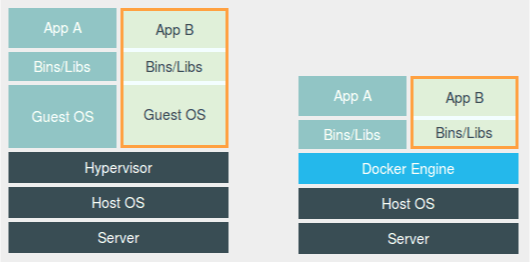

- 理解以下几个事实：

  - 容器技术的兴起源于 PaaS 技术的普及；
  - Docker 公司发布的 Docker 项目具有里程碑式的意义；
  - Docker 项目通过“容器镜像”，解决了应用打包这个根本性难题。
  - 容器本身没有价值，有价值的是“容器编排”。

- 容器其实是一种沙盒技术。顾名思义，沙盒就是能够像一个集装箱一样，把你的应用“装”起来的技术。这样，应用与应用之间，就因为有了边界而不至于相互干扰；实现这个“边界”的手段是什么？
- 一个程序运起来后的计算机执行环境的总和，就是我们今天的主角：进程。
- 对于进程来说，它的静态表现就是程序，平常都安安静静地待在磁盘上；而一旦运行起来，它就变成了计算机里的数据和状态的总和，这就是它的动态表现。
- 容器技术的核心功能，就是通过约束和修改进程的动态表现，从而为其创造出一个“边界”。
- **容器，其实是一种特殊的进程而已**。

- 这幅图的左边，画出了虚拟机的工作原理。其中，名为 Hypervisor 的软件是虚拟机最主要的部分。它通过硬件虚拟化功能，模拟出了运行一个操作系统需要的各种硬件，比如 CPU、内存、I/O 设备等等。然后，它在这些虚拟的硬件上安装了一个新的操作系统，即 Guest OS。
- 用户的应用进程就可以运行在这个虚拟的机器中，它能看到的自然也只有 Guest OS的文件和目录，以及这个机器里的虚拟设备。这就是为什么虚拟机也能起到将不同的应用进程相互隔离的作用。
- 这幅图的右边，则用一个名为 Docker Engine 的软件替换了 Hypervisor。这也是为什么，很多人会把 Docker
  项目称为“轻量级”虚拟化技术的原因，实际上就是把虚拟机的概念套在了容器上。

- **Cgroups 技术是用来制造约束的主要手段**。

- **Namespace 技术则是用来修改进程视图的主要方法**。【Namespace 的使用方式：它其实只是 Linux 创建新进程的一个可选参数。】

- Linux 操作系统还提供了 PID、Mount、UTS、IPC、Network 和 User 这些 Namespace，用来对各种不同的进程上下文进行“障眼法”操作。

- Linux 容器最基本的实现原理：

  实际上是在创建容器进程时，指定了这个进程所需要启用的一组 Namespace 参数。这样，容器就只能“看”到当前 Namespace所限定的资源、文件、设备、状态，或者配置。
