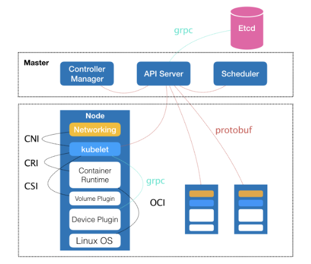
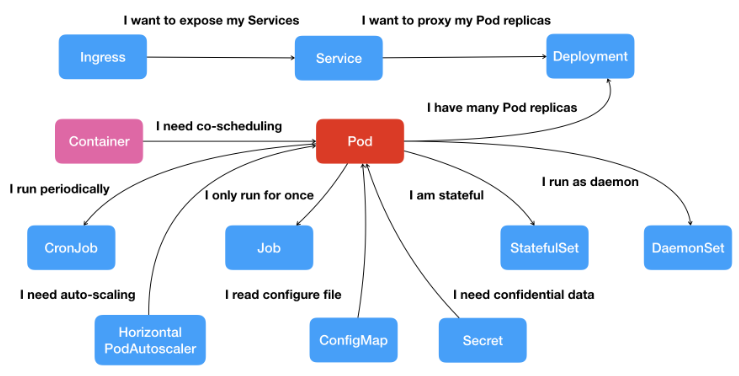

- 先思考一个问题：为什么是Kubernetes？

- 一个“容器”，实际上是一个由 Linux Namespace、Linux Cgroups 和 rootfs 三种技术构建出来的进程的隔离环境。
- 一个正在运行的 Linux 容器，其实可以被“一分为二”地看待：
  - 一组联合挂载在 /var/lib/docker/aufs/mnt 上的 rootfs，这一部分我们称为“容器镜像”（Container Image），是容器的静态视图；
  - 一个由 Namespace+Cgroups 构成的隔离环境，这一部分我们称为“容器运行时”（Container Runtime），是容器的动态视图。

- 容器从一个开发者手里的小工具，一跃成为了云计算领域的绝对主角；而能够定义容器组织和管理规范的“容器编排”技术，则当仁不让地坐上了容器技术领域的“头把交椅”。

- 最具代表性的容器编排工具，当属 Docker 公司的 Compose+Swarm 组合，以及 Google 与 RedHat 公司共同主导的 Kubernetes 项目。
- Kubernetes 项目在 Borg 体系的指导下，体现出了一种独有的“先进性”与“完备性”，而这些特质才是一个基础设施领域开源项目赖以生存的核心价值。

- Kubernetes 项目的架构：由 Master【控制节点】和 Node【计算节点】两种节点组成。

- 控制节点：**由三个紧密协作的独立组件组合而成，它们分别是负责 API 服务的 kube-apiserver、负责调度的 kube-scheduler，以及负责容器编排的kube-controller-manager。整个集群的持久化数据，则由 kube-apiserver 处理后保存在 Etcd 中**。
- 计算节点：最核心的组件kubelet【它有以下作用】
  - 1、主要负责同容器运行时（比如 Docker 项目）打交道【通过**CRI**（Container Runtime
    Interface）的远程调用接口】。**容器运行时则把 CRI 请求翻译成对 Linux 操作系统的调用**（操作 Linux Namespace 和 Cgroups 等）
  - 2、此外，kubelet 还通过 gRPC 协议同一个叫作 Device Plugin 的插件进行交互。这个插件，是 Kubernetes 项目用来管理 GPU等宿主机物理设备的主要组件，也是基于 Kubernetes 项目进行机器学习训练、高性能作业支持等工作必须关注的功能。
  - 3、kubelet通过**CNI**（Container Networking Interface）和 **CSI**（Container Storage Interface）调用网络插件和存储插件为容器配置网络和持久化存储。

- Kubernetes 项目【在Borg指导下】要着重解决的问题：**运行在大规模集群中的各种任务之间，实际上存在着各种各样的关系。这些关系的处理，才是作业编排和管理系统最困难的地方**。
- 这种任务与任务之间的关系，在我们平常的各种技术场景中随处可见。比如，一个 Web应用与数据库之间的访问关系，一个负载均衡器和它的后端服务之间的代理关系，一个门户应用与授权组件之间的调用关系。
- **Kubernetes的本质思考**：
  - 在容器技术普及之前，传统虚拟机环境对这种关系的处理方法都是比较“粗粒度”的。会经常发现很多功能并不相关的应用被一股脑儿地部署在同一台虚拟机中，只是因为它们之间偶尔会互相发起几个HTTP 请求。
  - 更常见的情况则是，一个应用被部署在虚拟机里之后，还得手动维护很多跟它协作的守护进程（Daemon），用来处理它的日志搜集、灾难恢复、数据备份等辅助工作。
- 但容器技术出现以后，就不难发现，在“功能单位”的划分上，容器有着独一无二的“细粒度”优势：毕竟容器的本质，只是一个进程而已。
- 也就是说，那些原先拥挤在同一个虚拟机里的各个应用、组件、守护进程，都可以被分别做成镜像，然后运行在一个个专属的容器中。它们之间互不干涉，拥有各自的资源配额，可以被调度在整个集群里的任何一台机器上。而这，正是一个PaaS系统最理想的工作状态，也是所谓“微服务”思想得以落地的先决条件。
- **如果只做到“封装微服务、调度单容器”这一层次，Docker Swarm + Compose 就已经戳戳有余**。
- **Kubernetes 项目最主要的设计思想是，从更宏观的角度，以统一的方式来定义任务之间的各种关系，并且为将来支持更多种类的关系留有余地**。
- 比如Service，Service 服务的主要作用，就是作为 Pod 的代理入口（Portal），从而代替 Pod 对外暴露一个固定的网络地址。Service后端真正代理的 Pod 的 IP 地址、端口等信息的自动更新、维护，则是 Kubernetes 项目的职责。

- 围绕着容器和 Pod 不断向真实的技术场景扩展，我们就能够摸索出一幅如下所示的 Kubernetes 项目核心功能的“全景图”。
  
- **从容器这个最基础的概念出发，首先遇到了容器间“紧密协作”关系的难题，于是就扩展到了 Pod；有了 Pod**
  **之后，我们希望能一次启动多个应用的实例，这样就需要 Deployment 这个 Pod 的多实例管理器；而有了这样一组相同的 Pod后，我们又需要通过一个固定的 IP 地址和端口以负载均衡的方式访问它，于是就有了 Service。如果Pod 之间需要访问授权等认证信息，那么就有了Secret。**
  **Kubernetes 还提供了其它基于 Pod 改进后的对象——比如 Job，用来描述一次性运行的 Pod（比如，大数据任务）；再比如DaemonSet，用来描述每个宿主机上必须且只能运行一个副本的守护进程服务；又比如 CronJob，则用于描述定时任务等等**。

- 在 Kubernetes 项目中，所推崇的使用方法是：【这就是 Kubernetes 最核心的设计理念】
  - 首先，通过一个“编排对象”，比如 Pod、Job、CronJob 等，来描述你试图管理的应用；
  - 然后，再为它定义一些“服务对象”，比如 Service、Secret、Horizontal Pod Autoscaler（自动水平扩展器）等。这些对象，会负责具体的平台级功能。
  - 这种使用方法，就是所谓的“声明式 API”。这种 API 对应的“编排对象”和“服务对象”，都是 Kubernetes 项目中的 API 对象（API Object）。
- **Kubernetes 项目所擅长的，是按照用户的意愿和整个系统的规则，完全自动化地处理好容器之间的各种关系。这种功能，就是：编排**。
- **Kubernetes 项目的本质，是为用户提供一个具有普遍意义的容器编排工具**。
- Kubernetes 它真正的价值，在于提供了一套基于容器构建分布式系统的基础依赖。

- Kubernetes 项目如何启动一个容器化任务呢？
  - 比如，现在已经制作好了一个 Nginx 容器镜像，希望让平台帮我启动这个镜像。并且，要求平台帮我运行两个完全相同的 Nginx副本，以负载均衡的方式共同对外提供服务。
  - 如果是自己 DIY 的话，可能需要启动两台虚拟机，分别安装两个 Nginx，然后使用 keepalived 为这两个虚拟机做一个虚拟 IP。
  - 而如果使用 Kubernetes 项目呢？你需要做的则是编写如下这样一个 YAML 文件（比如名叫 nginx-deployment.yaml）：