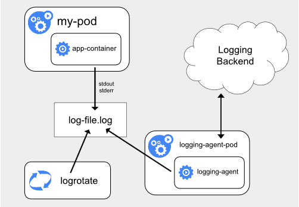
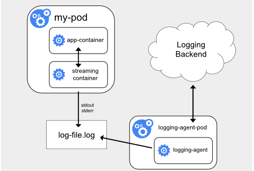
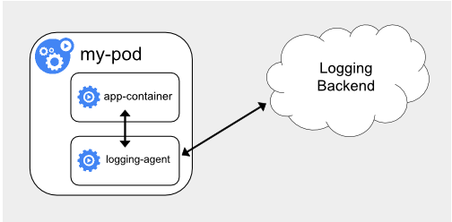

- Kubernetes 里面对容器日志的处理方式，都叫作 cluster-level-logging，即：这个日志处理系统，与容器、Pod 以及 Node
  的生命周期都是完全无关的。这种设计是为了保证，无论是容器挂了、Pod 被删除，甚至节点宕机的时候，应用的日志依然可以被正常获取到。
- Kubernetes 本身，实际上是不会为你做容器日志收集工作的，所以为了实现上述cluster-level-logging，需要在部署集群的时候，
  提前对具体的日志方案进行规划。

- Kubernetes 项目本身，主要为你推荐了三种日志方案:

- 第一种，在 Node 上部署 logging agent，将日志文件转发到后端存储里保存起来。

- 这里的核心就在于 logging agent ，它一般都会以 DaemonSet 的方式运行在节点上，然后将宿主机上的容器日志目录挂载进去，最后由
  logging-agent 把日志转发出去。【eg：可以通过 Fluentd 项目作为宿主机上的 logging-agent，然后把日志转发到远端的
  ElasticSearch 里保存起来供将来进行检索。】
- 在很多 Kubernetes 的部署里，会自动为你启用 logrotate，在日志文件超过 10MB 的时候自动对日志文件进行 rotate 操作。
- 在 Node 上部署 logging agent 最大的优点，在于一个节点只需要部署一个 agent，并且不会对应用和 Pod
  有任何侵入性。所以，这个方案，在社区里是最常用的一种。
- 不足之处就在于，它要求应用输出的日志，都必须是直接输出到容器的 stdout 和 stderr 里。

- Kubernetes 容器日志方案的第二种，就是对这种特殊情况的一个处理，即：当容器的日志只能输出到某些文件里的时候，我们可以通过一个
  sidecar 容器把这些日志文件重新输出到 sidecar 的 stdout 和 stderr 上，这样就能够继续使用第一种方案。

- sidecar 跟主容器之间是共享 Volume 的，所以这里的 sidecar 方案的额外性能损耗并不高，也就是多占用一点 CPU 和内存。
- 宿主机上实际上会存在两份相同的日志文件：一份是应用自己写入的；另一份则是 sidecar 的 stdout 和 stderr 对应的 JSON
  文件。这对磁盘是很大的浪费。所以说，除非万不得已或者应用容器完全不可能被修改，否则我还是建议你直接使用方案一，或者直接使用下面的第三种方案。

- 第三种方案，就是通过一个 sidecar 容器，直接把应用的日志文件发送到远程存储里面去。相当于把方案一里的 logging agent，放在了应用
  Pod 里。

- 这种方案虽然部署简单，并且对宿主机非常友好，但是这个 sidecar 容器很可能会消耗较多的资源，甚至拖垮应用容器。并且，由于日志还是没有输出到
  stdout 上，所以通过 kubectl logs 是看不到任何日志输出的。

- 除以上三种之外，还有一种方式就是在编写应用的时候，就直接指定好日志的存储后端。在这种方案下，Kubernetes
  就完全不必操心容器日志的收集了，这对于本身已经有完善的日志处理系统的公司来说，是一个非常好的选择。

- 注意：无论是哪种方案，你都必须要及时将这些日志文件从宿主机上清理掉，或者给日志目录专门挂载一些容量巨大的远程盘。否则，一旦主磁盘分区被打满，
  整个系统就可能会陷入奔溃状态，这是非常麻烦的。
