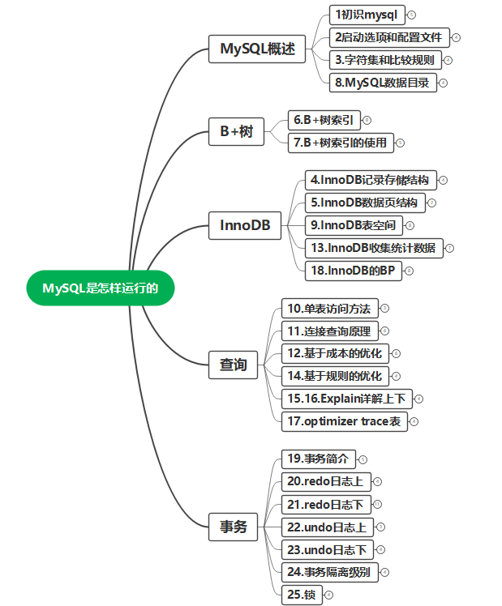
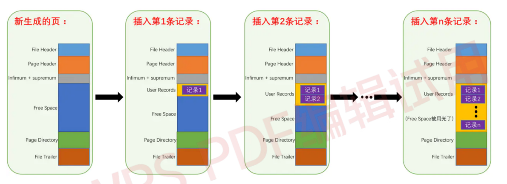
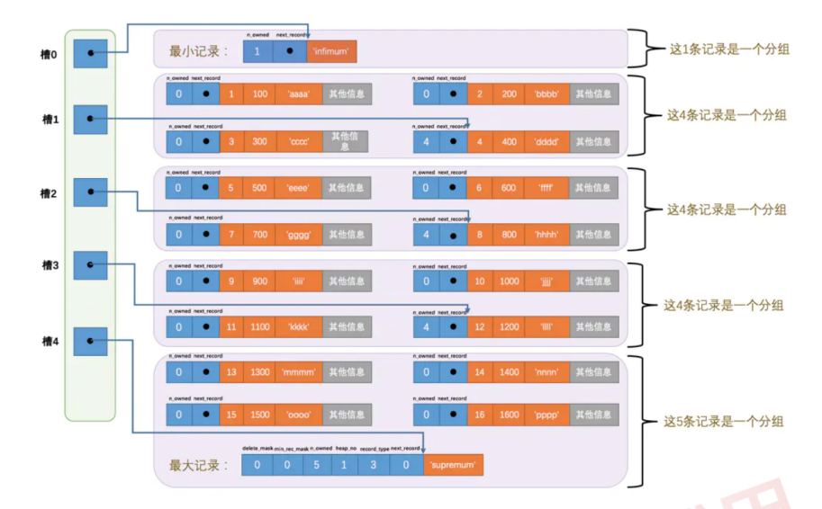
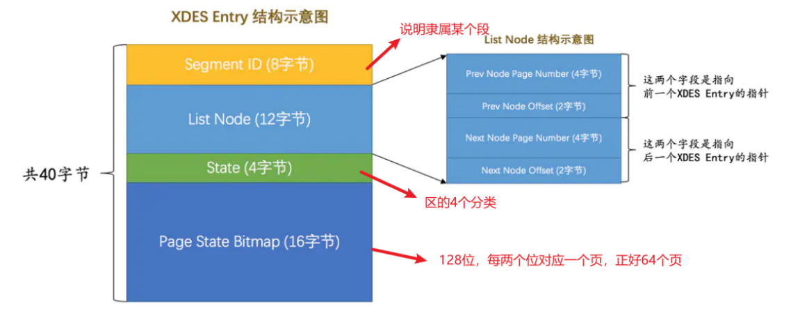
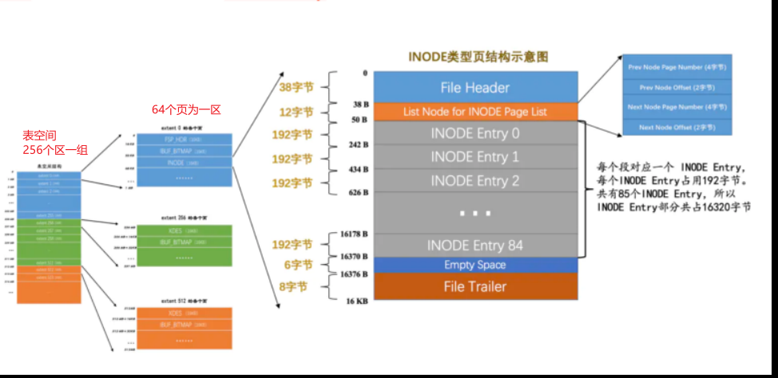
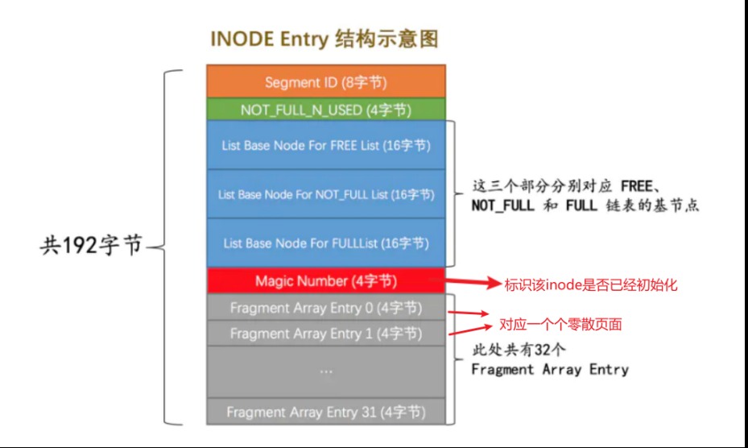
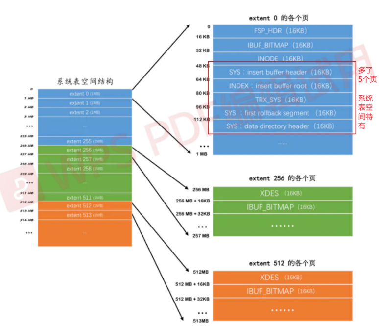
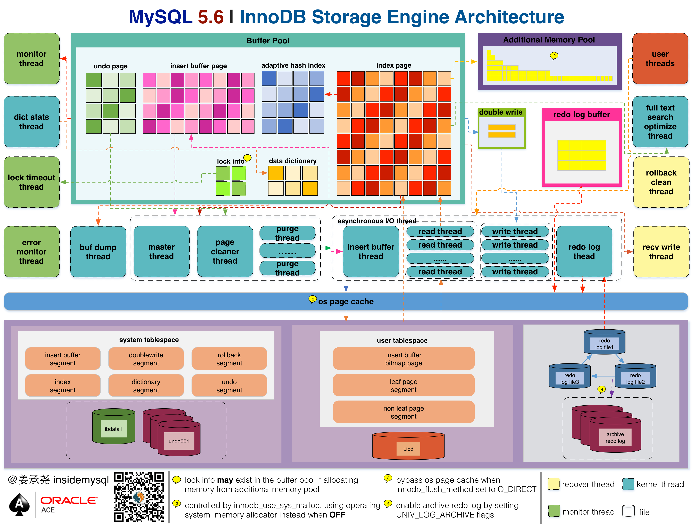

# MySQL是怎样运行的

> 内容来自对《MySQL 是怎样运行的：从根儿上理解 MySQL》这本书籍的学习。

## 一、MySQL概述

### 1、初识MySQL

- 1、mysql的C/S架构
  - mysql交互流程
  - 进程名：服务端mysqld，客户端mysql
- 2、mysql安装
  - 官网

- 3、mysql启动

  - 服务端
    - mysqld
    - mysqld_safe
    - mysql.server
    - mysqld_multi

  - 客户端
    - mysql ‐h主机名 ‐u用户名 ‐p密码

- 4、mysql连接

  - 客户端进程向服务器进程发请求并得到回复的过程本质上是一个进程间通信的过程
  - 连接方式1、TCP/IP连接
    - eg： `mysqld ‐P3307`
    - eg： `mysql ‐h127.0.0.1 ‐uroot ‐P3307 ‐p`
  - 连接方式2、Unix套接字文件连接
    - eg： `mysqld ‐‐socket=/tmp/a.txt`
    - eg： `mysql ‐hlocalhost ‐uroot ‐‐socket=/tmp/a.txt ‐p`

  - Windows专用命令

    - 命名管道
      - 服务端`‐‐enable‐named‐pipe`
      - 客户端`‐‐protocol=pipe`

    - 共享内存
      - 服务端`‐‐shared‐memory`
      - 客户端`‐‐protocol=memory`

  - SSL加密连接
  - 密码插件连接

- 5、mysql服务端处理流程
  - 第一部分：连接管理
  - 第二部分：解析与优化
    - 查询缓存：虽然查询缓存有时可以提升系统性能，但也不得不因维护这块缓存而造成一些开销，比如每次都要去查询缓存中检索，查询请求处理完需要更新查询缓存，维护该查询缓存对应的内存区域。从MySQL 5.7.20开始，不推荐使用查询缓存，并在MySQL 8.0中删除。
    - 语法解析：词法解析、语法分析、语义分析等。
    - 查询优化：外连接转换为内连接、表达式简化、子查询转为连接等等。
  - 第三部分：存储引擎
    - 真实的数据表存储的地方，它的功能就是接收上层传下来的指令，对表中数据进行提取与写入。
    - 各种不同的存储引擎向上边的MySQL server层提供统一的调用接口（也就是存储引擎API），包含了几十个底层函数，像"读取索引第一条内容"、"读取索引下一条内容"、"插入记录"等等。
    - 命令：`show engines`。

### 2、启动选项与配置文件

- 1、mysql启动选项

  - 启动选项的各个单词之间用短划线‐或者下划线_ 连接起来都可以，但是它对应的系统变量的单词之间必须使用下划线_连接起来。

  - 长形式启动命令：`mysqld ‐‐skip‐networking`或者`mysqld ‐‐skip_networking`
  - 短形式启动命令：`mysqld ‐‐default‐storage‐engine=MyISAM`
  - 推荐使用配置文件的方式来设置启动选项。

- 2、配置文件启动

  - 启动命令能读取的组

    - 服务器
      - mysqld——[mysqld]、[server]
      - mysqld_safe——[mysqld]、[server]、[mysqld_safe]
      - mysql.server——[mysqld]、[server]、[mysql.server]

    - 客户端
      - mysql——[mysql]、[client]
      - mysqladmin——[mysqladmin]、[client]
      - mysqldump——[mysqldump]、[client]

  - 配置文件优先级：同样的配置以最后一个出现的组中启动选项为准

    /etc/my.cnf < /etc/mysql/my.cnf < SYSCONFDIR/my.cnf < $MYSQL_HOME/my.cnf < ~/.my.cnf < ~/.mylogin.cnf

  - 命令行优先级高于配置文件

- 3、系统变量

  - 查看：`SHOW VARIABLES [LIKE 匹配的模式]`；

  - 设置：`SET [GLOBAL|SESSION] 系统变量名 = 值`；

    - SET 系统变量名=值 和 SET SESSION 系统变量名=值是等价的

    - 并不是所有系统变量都具有GLOBAL和SESSION的作用范围。

    - 有些系统变量是只读的，并不能设置值。

  - 作用范围：GLOBAL——全局变量，影响服务器的整体操作；SESSION——会话变量，影响某个客户端连接的操作。

- 4、状态变量
  - 查看：`SHOW [GLOBAL|SESSION] STATUS [LIKE 匹配的模式]`。
  - 启动选项是在程序启动时我们程序员传递的一些参数。系统变量是影响服务器程序运行行为的变量。状态变量让我们更好的了解服务器程序的运行情况。

### 3、字符集和比较规则

- 1、字符集发展历史
  - ASCII字符集→ISO 8859‐1字符集→GB2312字符集→GBK字符集→utf8字符集
- 2、utf8
  - utf8只是Unicode字符集的一种编码方案，Unicode字符集可以采用utf8、utf16、utf32这几种编码方案，utf8使用1～4个字节编码一个字符，utf16使用2个或4个字节编码一个字符，utf32使用4个字节编码一个字符。
- 3、mysql字符集
  - `utf8mb3`：在MySQL中utf8是utf8mb3的别名，所以之后在MySQL中提到utf8就意味着使用1~3个字节来表示一个字符。utf8mb3：阉割过的utf8字符集，只使用1～3个字节表示字符。
  - `utf8mb4`：正宗的utf8字符集，使用1～4个字节表示字符。
  - 每种字符集对应若干种比较规则，每种字符集都有一种默认的比较规则。
  - 查看字符集：`SHOW (CHARACTER SET|CHARSET)`。
  - 查看比较规则：`SHOW COLLATION`;
    - _ci 表示不区分大小写
    - _cs 表示区分大小写
    - _bin 表示以二进制方式比较

- 4、字符集应用

  - MySQL有4个级别的字符集和比较规则
    - 服务器级别
      - character_set_server
      - collation_server
    - 数据库级别
      - character_set_database
      - collation_database
      - 这两个系统变量是只读的，不能通过修改这两个变量的值而改变当前数据库的字符集和比较规则。
      - ①如果创建和修改数据库时没有指明字符集和比较规则，将使用服务器的字符集和比较规则。
    - 表级别
      - ②如果创建和修改表时没有指明字符集和比较规则，将使用该表所在数据库的字符集和比较规则。
    - 列级别
      - 同一个表中的不同的列也可以有不同的字符集和比较规则。
      - ③如果在创建和修改列时没有指明字符集和比较规则，将使用该列所在表的字符集和比较规则。

  - 由于字符集和比较规则是互相有联系的，如果我们只修改了字符集，比较规则也会跟着变化，如果只修改了比较规则，字符集也会跟着变化。
  - 如果对于同一个字符串编码和解码使用的字符集不一样，会产生意想不到的结果。

- 5、MySQL中字符集的转换

  - 从发送请求到返回结果这个过程中伴随着多次字符集的转换，在这个过程中会用到以下3个系统变量。
    - character_set_client——服务器解码请求时使用的字符集
    - character_set_connection——服务器处理请求时会把请求字符串从character_set_client转为character_set_connection
    - character_set_results——服务器向客户端返回数据时使用的字符集

  - `SET NAMES  字符集名`——等同于set以上三个系统变量。
    - 如果是Windows系统，那应该设置成gbk。
  - 配置文件中配置 `default‐character‐set`  也等同于设置上面三个系统变量。
  - 排序规则——比较规则的作用通常体现比较字符串大小的表达式以及对某个字符串列进行排序中，所以有时候也称为排序规则。

### 8、MySQL数据目录

- 1、查看：`SHOW VARIABLES LIKE 'datadir';`

- 2、DB在文件系统中的表示

  - 库文件表示

    - `CREATE DATABASE 数据库名`;     在数据目录下创建一个和数据库名同名的文件夹
    - 在该与数据库名同名的子目录下创建一个名为`db.opt`的文件，这个文件中包含了该数据库的各种属性，比方数据库的字符集和比较规则等
    - `information_schema`没有相应的数据目录

  - 表文件表示

    - `表名.frm`——存储表的结构。

    - 表空间或者文件空间（英文名：table space或者file space）

      - 系统表空间（system tablespace）
        - MySQL5.5.7—MySQL5.6.6之间的各个版本中，表中的数据默认存储位置
        - 默认名：ibdata1，是一个默认12M可以自扩展的文件。
        - `innodb_data_file_path=ibdata1:12M:autoextend`
        - `innodb_data_home_dir`

      - 独立表空间(file-per-table tablespace)
        - MySQL5.6.6及之后的版本，InnoDB默认为每一个表建立一个独立表空间
        - 默认名：`表名.ibd`
          - 存储数据和索引
          - `innodb_file_per_table`
          - `ALTER TABLE 表名 TABLESPACE [=] innodb_file_per_table`;

      - 通用表空间（general tablespace）
      - undo表空间（undo tablespace）
      - 临时表空间（temporary tablespace）

  - 视图文件表示

    - MySQL中的视图其实是虚拟的表，所以在存储视图的时候是不需要存储真实的数据的，只需要把它的结构存储起来。和表一样，描述视图结构的文件也会被存储到所属数据库对应的子目录下边，只会存储一个`视图名.frm`的文件

  - 其它文件表示

    - 服务器进程文件
    - 服务器日志文件
      - 查询日志、错误日志、二进制日志、redo日志等等

    - 默认/自动生成的SSL和RSA证书和密钥文件

- 3、MySQL系统数据库

  - `mysql`——核心库，存储了MySQL的用户账户和权限信息，一些存储过程、事件的定义信息，一些运行过程中产生的日志信息，一些帮助信息以及时区信息
  - `information_schema`——保存着MySQL服务器维护的所有其他数据库的信息，也称为元数据
  - `performance_schema`——保存MySQL服务器运行过程中的一些状态信息，类似性能监控
  - `sys`——通过视图将information_schema和performance_schema结合起来，程序员专用

## 二、B+树

### 6、B+树索引

- 1、引入B+树索引
  - 由于我们并不能快速的定位到记录所在的页，所以只能从第一个页沿着双向链表一直往下找，在每一个页中根据上述查找方式去查找指定的记录。如何高效完成搜索的方法→索引。
  -  InnoDB 的各个数据页可以组成一个 **双向链表** ，而每个数据页中的记录会按照主键值从小到大的顺序组成一个 单向链表 ，每个数据页都会为存储在它里边儿的记录生成一个 **页目录** ，在通过主键查找某条记录的时候可以在 页目录 中使用**二分法**快速定位到对应的**槽**，然后再遍历该槽对应分组中的记录即可快速找到指定的记录。

- 2、目录项记录 v.s. 用户记录

  - 目录项记录（record_type=1） 的节点称为 非叶子节点。
  - 用户记录（record_type=0） 的节点称为 叶子节点。
  - 一般情况下，我们用到的 B+ 树都不会超过4层，那我们通过主键值去查找某条记录最多只需要做4个页面内的查找（查找3个目录项页和一个用户记录页），又因为在每个页面内有所谓的 Page Directory （页目录），所以在页面内也可以通过二分法实现快速定位记录。

  

- 3、 B+ 树的形成过程
  
  - 先创建根节点页面。一个B+树索引的根节点自诞生之时起，便不会再移动。 根节点 的页号会被存到一个固定的地方，以供随时使用。
  - 随后向表中插入用户记录时，先把用户记录存储到这个 根节点 中。
  - 根节点可用空间用完时继续插入记录，就会将根节点复制到一个新页，新页页分裂得出第二个页， 根节点 便从存储**用户记录**升级为存储**目录项记录**的页。
  
- 4、聚簇索引

  - 特点1：使用记录主键值的大小进行记录和页的排序。
  - 特点2： B+ 树的叶子节点存储的是完整的用户记录。即：**索引即数据，数据即索引**。

- 5、二级索引

  - 按照 非主键列 建立的 B+ 树需要一次 回表 操作才可以定位到完整的用户记录，所以这种 B+ 树也被称为 二级索引 （英文名 secondary index ），或者 辅助索引 。

- 6、联合索引

  - 同时以多个列的大小作为排序规则，也就是同时为多个列建立索引。

- 7、创建索引sql

  - `ALTER TABLE 表名 ADD [INDEX|KEY] 索引名 (需要被索引的单个列或多个列);`
  - `ALTER TABLE 表名 DROP [INDEX|KEY] 索引名;`

- 8、索引代价
  - 空间上的代价：每建立一个索引都要为它建立一棵 B+ 树。
  - 时间上的代价：每次对表中的数据进行增、删、改操作时，都需要去修改各个 B+ 树索引。
  - 回表代价：需要回表的记录越多，使用二级索引的性能就越低，甚至让某些查询宁愿使用全表扫描也不使用 二级索引 。因此由查询优化器分析到底是使用二级索引+回表，还是使用全表扫描。

### 7、B+树索引的应用

- 1、好的应用：
  - 覆盖索引：最好在查询列表里只包含索引列，把这种只需要用到索引的查询方式称为索引覆盖。
  - 全值匹配：如果我们的搜索条件中的列和索引列一致的话，这种情况就称为全值匹配。
  - 匹配左边的列：搜索语句中也可以不用包含全部联合索引中的列，只包含左边的就行。
  - 匹配列前缀：如`SELECT * FROM user WHERE name LIKE 'Jac%'; `
  - 匹配范围值：如果对多个列同时进行范围查找的话，只有对索引最左边的那个列进行范围查找的时候才能用到 B+ 树索引。如：`SELECT * FROM user WHERE name > 'Tom' AND name < 'Jerry';`
  - 精确匹配某一列并范围匹配另外一列：如`SELECT * FROM user WHERE name = 'Tom' AND age > '18' AND age < '25';`
  - 用于排序：MySQL把在内存中或者磁盘上进行排序的方式统称为文件排序（英文名： filesort ）。但是如果 ORDER BY 子句里使用到了索引列，就有可能省去在内存或文件中排序的步骤。
  - 用于分组：如`SELECT COUNT(*) FROM user GROUP BY name, age;`

- 2、不好的应用：
  - ASC、DESC混用。
  - 排序列使用了复杂的表达式。
  - 排序列包含非同一个索引的列。
  - WHERE子句中出现非排序使用到的索引列。

- 3、如何创建索引：
  - 主键最好自增
  - 只为用于搜索、排序或分组的列创建索引
  - 不要冗余和重复索引
  - 考虑列的基数
  - 索引列的类型尽量小
  - 索引字符串值的前缀
  - 让索引列在比较表达式中单独出现

## 三、InnoDB存储引擎

> 存储引擎都是把表存储在文件系统上的。InnoDB这个存储引擎的数据如何在文件系统中存储的？

### 4、InnoDB行记录结构

- InnoDB行格式有四种：Compact、Redundant、Dynamic[mysql5.7默认]、Compressed
  - 行溢出：在Compact和Redundant行格式中，对于占用存储空间非常大的列，在记录的真实数据处只会存储该列的一部分数据【768个字节】，把剩余的数据分散存储在几个其他的页中，然后记录的真实数据处用20个字节存储指向这些页的地址（当然这20个字节中还包括这些分散在其他页面中的数据的占用的字节数），从而可以找到剩余数据所在的页。
  - 行溢出：Dynamic和Compressed行格式，它们直接把所有的字节都存储到其他页面中，只在记录的真实数据处存储其他页面的地址。
- 行记录组成：
  - 1、记录的额外信息
    - 变长字段长度列表
    - NULL值列表
    - 记录头信息：record_type记录属性、next_record链表
  - 2、记录的真实数据
    - DB_ROW_ID：主键Id
      - 优先使用用户自定义主键作为主键，如果用户没有定义主键，则选取一个Unique键作为主键，如果表中连Unique键都没有定义的话，则InnoDB会为表默认添加一个名为row_id的隐藏列作为主键。
    - DB_TRX_ID：事务ID，用于实现MVCC
    - DB_ROLL_PTR：版本链执行，用于实现MVCC
    - 自定义列值：用户数据

### 5、InnoDB数据页结构

- 页是MySQL中磁盘和内存交互的基本单位，也是MySQL是管理存储空间的基本单位。
- InnoDB采取：将数据划分为若干个页，以页作为磁盘和内存之间交互的基本单位，InnoDB中页的大小一般为 16 KB。也就是在一般情况下，一次最少从磁盘中读取16KB的内容到内存中，一次最少把内存中的16KB内容刷新到磁盘中。
- InnoDB为了不同的目的而设计了不同类型的页，把用于存放记录的页叫做**数据页**。
- 数据页一般都有以下7种组成结构：
  - 1、File Header
    - 所有页都有的通用头部。
    - 每个数据页的 File Header 部分都有上一个和下一个页的编号，所以所有的数据页会组成一个 **双链表**。
  - 2、Page Header
    - 专门存储数据页的各种状态信息。
  - 3、Infimum + Supremum
    - 最小记录和最大记录，是虚拟的行记录
  - 4、User Records
    - 每个记录的头信息中都有一个 next_record 属性，从而使页中的所有记录串联成一个 **单链表** 。
  - 5、Free Space
    - 空闲空间。
    - 
  - 6、Page Directory
    - 在数据页中查找指定主键过程：1. 通过二分法确定该记录所在的槽，并找到该槽所在分组中主键值最小的那条记录。通过记录的 next_record 属性遍历该槽所在的组中的各个记录。
    - 
  - 7、File Trailer
    - 所有页都有的通用尾部。
    - 专门用来检验页的完整性。

### 9、InnoDB表空间

> - InnoDB是如何保存数据到文件系统的？
> - InnoDB表空间就像一个大池子，里面有许多页，需要进行数据的CRUD时，就从池子里捞出一个页来操作。
> - 那么如何更好的管理数据页？如何提高插入数据的效率→ 区、段、碎片区、附属于段的区、XDES Entry、INODE Entry等。【MySQL团队们在这里面做了很多的小设计】

- 1、区

  - **引入区**
    - 在表中数据量大的时候，为某个索引分配空间的时候就不再按照页为单位分配了，而是按照 区 为单位分配，甚至在表中的数据十分非常特别多的时候，可以一次性分配多个连续的区。→ 顺序I/O
    - 如果是以 页 为单位来分配存储空间的话，双向链表相邻的两个页之间的物理位置可能离得非常远。→ 随机I/O

  - 对于16KB的页来说，连续的64个页就是一个 区（默认占用1MB空间）。
  - **不论是系统表空间还是独立表空间，都可以看成是由若干个区组成的**。
  - 每256个区又会被划分成一组。每个分组的第一个区的前三个页面都有专门的作用。
    - 第一个页面：FSP_HDR——主要记录当前分组的 256个 XDES Entry信息，对应256个区
    - 第二个页面：IBUF_BITMAP——记录Change Buffer信息
    - 第三个页面：INODE——记录 85个 段 INODE Entry 信息
  - 区的描述：**XDES Entry**
    - 每个区都有对应一个XDES Entry结构，记录对应区的属性信息。
    - 
  - 区的分类：
    - FREE：空闲的区
    - FREE_FRAG：有剩余空间的碎片区
    - FULL_FRAG：没有剩余空间的碎片区
    - FSEG：附属于某个段的区

  - 牢记：**页、区、分组、段之间的关系**：

- 2、段

  - **引入段**
    - 如果不区分叶子节点和非叶子节点，统统把节点代表的页面放到申请到的区中的话，进行范围扫描的效果就大打折扣。
    - 存放叶子节点的区的集合就算是一个 段 （ segment ），存放非叶子节点的区的集合也算是一个 段。也就是说一个索引会生成2个段，一个叶子节点段，一个非叶子节点段。
    - 索引的叶子节点段和非叶子节点段之外，InnoDB 中还有为存储一些特殊的数据而定义的段，比如回滚段。

  - 段的描述：**INODE Entry**
    - 每个段都定义了一个 INODE Entry 结构来记录段中的属性。
    - 

  - 向某个段插入数据的过程：
    - 当段中数据较少的时候，首先根据FREE_FRAG链表，从该链表的节点中取一些零散的页把数据插进去，当这个节点对应的区用完时，就修改一下这个节点的 State字段的值，然后从 FREE_FRAG 链表中移到 FULL_FRAG 链表中。如果FREE_FRAG链表一个节点都没有，则从FREE链表中去拿一个节点，将State字段从FREE修改为FREE_FRAG。
    - 当段中数据已经占满了32个零散页后，就直接申请完整的区来插入数据。

  - 段是逻辑概念。段 是某些零散的页面以及一些完整的区的集合。

  - 段分配策略：
    - 在刚开始向表中插入数据的时候，段是从某个碎片区以单个页面为单位来分配存储空间的。
    - 当某个段已经占用了32个碎片区页面之后，就会以完整的区为单位来分配存储空间。

- 3、碎片区
  - **引入碎片区**
    - 为了考虑以完整的区为单位分配给某个段，对于数据量较小的表太浪费存储空间的这种情况。
    - 碎片区直属于表空间，并不属于任何一个段。

- 4、**链表**

  - MySQL团队做了很多链表的设计。

  - 直属表空间的三个链表
    - ①、FREE链表：把状态为 FREE 的区对应的 XDES Entry 结构通过 List Node 来连接成一个链表
    - ②、FREE_FRAG 链表：把状态为 FREE_FRAG 的区对应的 XDES Entry 结构通过 List Node 来连接成一个链表
    - ③、FULL_FRAG 链表：把状态为 FULL_FRAG 的区对应的 XDES Entry 结构通过 List Node 来连接成一个链表
  - 直属段的的三个链表
    - ①、FREE 链表：同一个段中，所有页面都是空闲的区对应的 XDES Entry 结构
    - ②、NOT_FULL 链表：同一个段中，仍有空闲空间的区对应的 XDES Entry结构
    - ③、FULL 链表：同一个段中，已经没有空闲空间的区对应的 XDES Entry 结构

  - 每一个索引都对应两个段，每个段都会维护3个链表【直属段的】。**举例**：假设一个表有一个主键索引和一个普通索引，则它共有4个段，每个段都有3个链表，加上直属表空间的3个链表，整个独立表空间需要维护一共有15个链表【4x3+3=15】。
  - 这么多链表怎么找？→ 链表基节点（List Base Node）：记录描述链表的信息。每个链表对应一个List Base Node链表基节点结构。

- 5、系统表空间
  - 系统表空间示意图：
  - 系统表空间的 extent 1 和 extent 2 这两个区，也就是页号从64 ~ 191 这128个页面被称为 Doublewrite buffer ，也就是**双写缓冲区**。
  - 内部系统表：SYS_TABLES、SYS_COLUMNS、SYS_INDEXES、SYS_FIELDS等
    - 为了更好的管理我们这些用户数据而不得已引入的一些额外数据，这些数据也称为 元数据 。InnoDB存储引擎特意定义了一些列的内部系统表（internal system table）来记录这些这些 元数据。
    - 这些系统表也称为数据字典，它们都是以 B+ 树的形式保存在系统表空间的某些页面中。它们通过硬编码到代码中，系统表空间的页号为7的页面 Data Dictionary Header 记录了这些系统表的信息。
    - 如何访问：`use information_schema;';`,`SHOW TABLES LIKE 'INNODB_SYS%';`（以 innodb_sys 开头的表并不是真正的内部系统表，只是存储引擎启动时读取这些以 SYS 开头的系统表，然后填充到这些以 innodb_sys 开头的表中）

### 13、InnoDB收集统计数据

- 常用查看统计数据命令
  - `show engine innodb status;`
  - `show index from tableName;`
  - `show table status;`
- 统计数据保存
  - 持久化的统计数据：`show variables like '%innodb_stats_persistent%';`
  - 非持久化的统计数据：`show variables like '%innodb_stats_transient%';`

- 两张表：`mysql.innodb_table_stats`和`mysql.innodb_index_stats`

- **n_rows计算**方式
  - 按照一定算法（并不是纯粹随机的）选取几个叶子节点页面，计算每个页面中主键值记录数量，然后计算平均一个页面中主键值的记录数量乘以全部叶子节点的数量就算是该表的
  - 采样多少个页面→建表时可以指定 STATS_SAMPLE_PAGES，如未指定，则默认根据系统变量：innodb_stats_persistent_sample_pages【默认20】

- 统计数据更新
  - `ANALYZE TABLE`语句会立即重新计算统计数据，也就是这个过程是同步的，在表中索引多或者采样页面特别多时这个过程 可能会特别慢，请不要没事儿就运行一下ANALYZE TABLE语句，最好在业务不是很繁忙的时候再运行。

- 列的基数估算与NULL值

  

### 18、InnoDB的Buffer Pool

> InnoDB是如何高效的在文件系统和内存之间传递数据的？

## 四、查询

### 10、单表访问方法

### 11、连接查询原理

### 12、基于成本的优化

### 14、基于规则的优化

### 15/16、Explain

### 17、optimizer trace表

## 五、事务

### 19、事务简介

### 20、redo日志上

### 21、redo日志下

### 22、undo日志上

### 23、undo日志下

### 24、事务隔离级别

### 25、锁