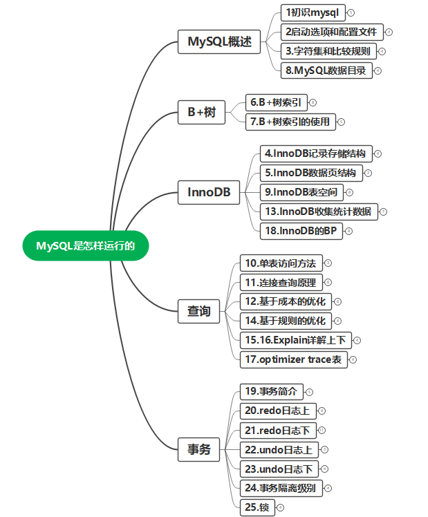
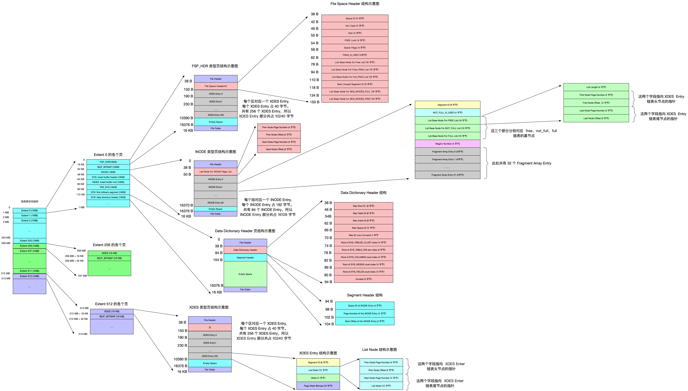

# MySQL是怎样运行的

## 一、MySQL概述

### 1、初识MySQL

- 1、mysql的C/S架构
  - mysql交互流程
  - 进程名：服务端mysqld，客户端mysql
- 2、mysql安装
  - 官网

- 3、mysql启动

  - 服务端
    - mysqld
    - mysqld_safe
    - mysql.server
    - mysqld_multi

  - 客户端
    - mysql ‐h主机名 ‐u用户名 ‐p密码

- 4、mysql连接

  - 客户端进程向服务器进程发请求并得到回复的过程本质上是一个进程间通信的过程
  - 连接方式1、TCP/IP连接
    - eg： `mysqld ‐P3307`
    - eg： `mysql ‐h127.0.0.1 ‐uroot ‐P3307 ‐p`
  - 连接方式2、Unix套接字文件连接
    - eg： `mysqld ‐‐socket=/tmp/a.txt`
    - eg： `mysql ‐hlocalhost ‐uroot ‐‐socket=/tmp/a.txt ‐p`

  - Windows专用命令

    - 命名管道
      - 服务端`‐‐enable‐named‐pipe`
      - 客户端`‐‐protocol=pipe`

    - 共享内存
      - 服务端`‐‐shared‐memory`
      - 客户端`‐‐protocol=memory`

  - SSL加密连接
  - 密码插件连接

- 5、mysql服务端处理流程
  - 第一部分：连接管理
  - 第二部分：解析与优化
    - 查询缓存：虽然查询缓存有时可以提升系统性能，但也不得不因维护这块缓存而造成一些开销，比如每次都要去查询缓存中检索，查询请求处理完需要更新查询缓存，维护该查询缓存对应的内存区域。从MySQL 5.7.20开始，不推荐使用查询缓存，并在MySQL 8.0中删除。
    - 语法解析：词法解析、语法分析、语义分析等。
    - 查询优化：外连接转换为内连接、表达式简化、子查询转为连接等等。
  - 第三部分：存储引擎
    - 真实的数据表存储的地方，它的功能就是接收上层传下来的指令，对表中数据进行提取与写入。
    - 各种不同的存储引擎向上边的MySQL server层提供统一的调用接口（也就是存储引擎API），包含了几十个底层函数，像"读取索引第一条内容"、"读取索引下一条内容"、"插入记录"等等。
    - 命令：`show engines`。

### 2、启动选项与配置文件

- 1、mysql启动选项

  - 启动选项的各个单词之间用短划线‐或者下划线_ 连接起来都可以，但是它对应的系统变量的单词之间必须使用下划线_连接起来。

  - 长形式启动命令：`mysqld ‐‐skip‐networking`或者`mysqld ‐‐skip_networking`
  - 短形式启动命令：`mysqld ‐‐default‐storage‐engine=MyISAM`
  - 推荐使用配置文件的方式来设置启动选项。

- 2、配置文件启动

  - 启动命令能读取的组

    - 服务器
      - mysqld——[mysqld]、[server]
      - mysqld_safe——[mysqld]、[server]、[mysqld_safe]
      - mysql.server——[mysqld]、[server]、[mysql.server]

    - 客户端
      - mysql——[mysql]、[client]
      - mysqladmin——[mysqladmin]、[client]
      - mysqldump——[mysqldump]、[client]

  - 配置文件优先级：同样的配置以最后一个出现的组中启动选项为准

    /etc/my.cnf < /etc/mysql/my.cnf < SYSCONFDIR/my.cnf < $MYSQL_HOME/my.cnf < ~/.my.cnf < ~/.mylogin.cnf

  - 命令行优先级高于配置文件

- 3、系统变量

  - 查看：`SHOW VARIABLES [LIKE 匹配的模式]`；

  - 设置：`SET [GLOBAL|SESSION] 系统变量名 = 值`；

    - SET 系统变量名=值 和 SET SESSION 系统变量名=值是等价的

    - 并不是所有系统变量都具有GLOBAL和SESSION的作用范围。

    - 有些系统变量是只读的，并不能设置值。

  - 作用范围：GLOBAL——全局变量，影响服务器的整体操作；SESSION——会话变量，影响某个客户端连接的操作。

- 4、状态变量
  - 查看：`SHOW [GLOBAL|SESSION] STATUS [LIKE 匹配的模式]`。
  - 启动选项是在程序启动时我们程序员传递的一些参数。系统变量是影响服务器程序运行行为的变量。状态变量让我们更好的了解服务器程序的运行情况。

### 3、字符集和比较规则

- 1、字符集发展历史
  - ASCII字符集→ISO 8859‐1字符集→GB2312字符集→GBK字符集→utf8字符集
- 2、utf8
  - utf8只是Unicode字符集的一种编码方案，Unicode字符集可以采用utf8、utf16、utf32这几种编码方案，utf8使用1～4个字节编码一个字符，utf16使用2个或4个字节编码一个字符，utf32使用4个字节编码一个字符。
- 3、mysql字符集
  - `utf8mb3`：在MySQL中utf8是utf8mb3的别名，所以之后在MySQL中提到utf8就意味着使用1~3个字节来表示一个字符。utf8mb3：阉割过的utf8字符集，只使用1～3个字节表示字符。
  - `utf8mb4`：正宗的utf8字符集，使用1～4个字节表示字符。
  - 每种字符集对应若干种比较规则，每种字符集都有一种默认的比较规则。
  - 查看字符集：`SHOW (CHARACTER SET|CHARSET)`。
  - 查看比较规则：`SHOW COLLATION`;
    - _ci 表示不区分大小写
    - _cs 表示区分大小写
    - _bin 表示以二进制方式比较

- 4、字符集应用

  - MySQL有4个级别的字符集和比较规则
    - 服务器级别
      - character_set_server
      - collation_server
    - 数据库级别
      - character_set_database
      - collation_database
      - 这两个系统变量是只读的，不能通过修改这两个变量的值而改变当前数据库的字符集和比较规则。
      - ①如果创建和修改数据库时没有指明字符集和比较规则，将使用服务器的字符集和比较规则。
    - 表级别
      - ②如果创建和修改表时没有指明字符集和比较规则，将使用该表所在数据库的字符集和比较规则。
    - 列级别
      - 同一个表中的不同的列也可以有不同的字符集和比较规则。
      - ③如果在创建和修改列时没有指明字符集和比较规则，将使用该列所在表的字符集和比较规则。

  - 由于字符集和比较规则是互相有联系的，如果我们只修改了字符集，比较规则也会跟着变化，如果只修改了比较规则，字符集也会跟着变化。
  - 如果对于同一个字符串编码和解码使用的字符集不一样，会产生意想不到的结果。

- 5、MySQL中字符集的转换

  - 从发送请求到返回结果这个过程中伴随着多次字符集的转换，在这个过程中会用到以下3个系统变量。
    - character_set_client——服务器解码请求时使用的字符集
    - character_set_connection——服务器处理请求时会把请求字符串从character_set_client转为character_set_connection
    - character_set_results——服务器向客户端返回数据时使用的字符集

  - `SET NAMES  字符集名`——等同于set以上三个系统变量。
    - 如果是Windows系统，那应该设置成gbk。
  - 配置文件中配置 `default‐character‐set`  也等同于设置上面三个系统变量。
  - 排序规则——比较规则的作用通常体现比较字符串大小的表达式以及对某个字符串列进行排序中，所以有时候也称为排序规则。

### 4、MySQL数据目录

- 1、查看：`SHOW VARIABLES LIKE 'datadir';`

- 2、DB在文件系统中的表示

  - 库文件表示

    - `CREATE DATABASE 数据库名`;     在数据目录下创建一个和数据库名同名的文件夹
    - 在该与数据库名同名的子目录下创建一个名为`db.opt`的文件，这个文件中包含了该数据库的各种属性，比方数据库的字符集和比较规则等
    - `information_schema`没有相应的数据目录

  - 表文件表示

    - `表名.frm`——存储表的结构。

    - 表空间或者文件空间（英文名：table space或者file space）

      - 系统表空间（system tablespace）
        - MySQL5.5.7—MySQL5.6.6之间的各个版本中，表中的数据默认存储位置
        - 默认名：ibdata1，是一个默认12M可以自扩展的文件。
        - `innodb_data_file_path=ibdata1:12M:autoextend`
        - `innodb_data_home_dir`

      - 独立表空间(file-per-table tablespace)
        - MySQL5.6.6及之后的版本，InnoDB默认为每一个表建立一个独立表空间
        - 默认名：`表名.ibd`
          - 存储数据和索引
          - `innodb_file_per_table`
          - `ALTER TABLE 表名 TABLESPACE [=] innodb_file_per_table`;

      - 通用表空间（general tablespace）
      - undo表空间（undo tablespace）
      - 临时表空间（temporary tablespace）

  - 视图文件表示

    - MySQL中的视图其实是虚拟的表，所以在存储视图的时候是不需要存储真实的数据的，只需要把它的结构存储起来。和表一样，描述视图结构的文件也会被存储到所属数据库对应的子目录下边，只会存储一个`视图名.frm`的文件

  - 其它文件表示

    - 服务器进程文件
    - 服务器日志文件
      - 查询日志、错误日志、二进制日志、redo日志等等

    - 默认/自动生成的SSL和RSA证书和密钥文件

- 3、MySQL系统数据库

  - `mysql`——核心库，存储了MySQL的用户账户和权限信息，一些存储过程、事件的定义信息，一些运行过程中产生的日志信息，一些帮助信息以及时区信息
  - `information_schema`——保存着MySQL服务器维护的所有其他数据库的信息，也称为元数据
  - `performance_schema`——保存MySQL服务器运行过程中的一些状态信息，类似性能监控
  - `sys`——通过视图将information_schema和performance_schema结合起来，程序员专用

## 二、B+树

### 1、B+树索引

- 1、引入B+树索引
  - 由于我们并不能快速的定位到记录所在的页，所以只能从第一个页沿着双向链表一直往下找，在每一个页中根据上述查找方式去查找指定的记录。如何高效完成搜索的方法→索引。
  -  InnoDB 数据页的7个组成部分，各个数据页可以组成一个 双向链表 ，而每个数据页中的记录会按照主键值从小到大的顺序组成一个 单向链表 ，每个数据页都会为存储在它里边儿的记录生成一个 页目录 ，在通过主键查找某条记录的时候可以在 页目录 中使用二分法快速定位到对应的槽，然后再遍历该槽对应分组中的记录即可快速找到指定的记录。

- 2、目录项记录 v.s. 用户记录
- 3、 B+ 树的形成过程
  - 先创建根节点页面。一个B+树索引的根节点自诞生之时起，便不会再移动。 根节点 的页号会被存到一个固定的地方，以供随时使用。
  - 随后向表中插入用户记录时，先把用户记录存储到这个 根节点 中。
  - 根节点可用空间用完时继续插入记录，就会将根节点复制到一个新页，新页页分裂得出第二个页， 根节点 便升级为存储目录项记录的页。
- 4、聚簇索引
- 5、二级索引
- 6、联合索引
- 7、索引sql

### 2、B+树索引的应用

## 三、InnoDB存储引擎

> 存储引擎都是把表存储在文件系统上的。InnoDB这个存储引擎的数据如何在文件系统中存储的。

### 1、InnoDB行记录结构

### 2、InnoDB数据页结构

### 3、InnoDB表空间

### 4、InnoDB收集统计数据

### 5、InnoDB的Buffer Pool

## 四、查询

### 1、单表访问方法

### 2、连接查询原理

### 3、基于成本的优化

### 4、基于规则的优化

### 5、

### 6、

## 五、事务

### 1、

### 2、

### 3、
