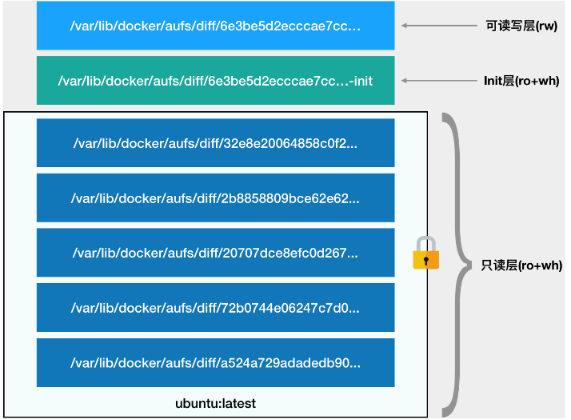

- Linux 容器最基础的两种技术：Namespace 和 Cgroups。Namespace 的作用是“隔离”，它让应用进程只能看到该 Namespace 内的“世界”；而
  Cgroups 的作用是“限制”，它给这个“世界”围上了一圈看不见的墙。
- 容器里的进程看到的文件系统是什么样子？——容器进程看到的文件系统也跟宿主机完全一样。
- Mount Namespace 跟其他 Namespace 的使用略有不同的地方：它对容器进程视图的改变，一定是伴随着挂载操作（mount）才能生效。
- Mount Namespace 正是基于对 chroot 的不断改良才被发明出来的，它也是 Linux 操作系统里的第一个 Namespace。

- 在 Linux 操作系统里有个chroot命令，它的作用就是帮你“change root file system”，即改变进程的根目录到指定的位置。它的用法也非常简单。

```shell
# 首先，创建一个 test 目录和几个 lib 文件夹：
[root@mylinux ~]# mkdir -p $HOME/test
[root@mylinux ~]# mkdir -p $HOME/test/{bin,lib64,lib}
[root@mylinux ~]# cd $T
# 然后，把 bash 命令拷贝到 test 目录对应的 bin 路径下：
[root@mylinux ~]# cp -v /bin/{bash,ls} $HOME/test/bin
# 把 bash 命令需要的所有 so 文件，也拷贝到 test 目录对应的 lib 路径下。
[root@mylinux ~]# T=$HOME/test
[root@mylinux ~]# list="$(ldd /bin/ls | egrep -o '/lib.*\.[0-9]')"
[root@mylinux ~]# for i in $list; do cp -v "$i" "${T}${i}"; done
# 最后，执行 chroot 命令，告诉操作系统，我们将使用 $HOME/test 目录作为 /bin/bash 进程的根目录：
[root@mylinux ~]#  chroot $HOME/test /bin/bash
```

- 这个挂载在容器根目录上、用来为容器进程提供隔离后执行环境的文件系统，就是所谓的“容器镜像”。它还有一个更为专业的名字，
  叫作：rootfs（根文件系统）。
- rootfs 只是一个操作系统所包含的文件、配置和目录，并不包括操作系统内核。在 Linux
  操作系统中，这两部分是分开存放的，操作系统只有在开机启动时才会加载指定版本的内核镜像。
- 这就意味着，如果应用程序需要配置内核参数、加载额外的内核模块，以及跟内核进行直接的交互，就需要注意了：这些操作和依赖的对象，
  都是宿主机操作系统的内核，它对于该机器上的所有容器来说是一个“全局变量”，牵一发而动全身。

- 不过，正是由于 rootfs 的存在，容器才有了一个被反复宣传至今的重要特性：一致性。
- 由于 rootfs 里打包的不只是应用，而是整个操作系统的文件和目录，也就意味着，应用以及它运行所需要的所有依赖，都被封装在了一起。
- 有了容器镜像“打包操作系统”的能力，这个最基础的依赖环境也终于变成了应用沙盒的一部分。这就赋予了容器所谓的一致性：无论在本地、云端，
  还是在一台任何地方的机器上，用户只需要解压打包好的容器镜像，那么这个应用运行所需要的完整的执行环境就被重现出来
- 这种深入到操作系统级别的运行环境一致性，打通了应用在本地开发和远端执行环境之间难以逾越的鸿沟。


- 对 Docker 项目来说，它最核心的原理实际上就是为待创建的用户进程：
  1、启用 Linux Namespace 配置；
  2、设置指定的 Cgroups 参数；
  3、切换进程的根目录（Change Root）。

- Docker 公司在实现 Docker 镜像时并没有沿用以前制作 rootfs 的标准流程，而是做了一个小小的创新：
  Docker 在镜像的设计中，引入了层（layer）的概念。也就是说，用户制作镜像的每一步操作，都会生成一个层，也就是一个增量 rootfs。
- 这个创新是用到了一种叫作联合文件系统（Union File System）的能力。

- 以 ubuntu:latest 镜像为例，这个容器的 rootfs 由如下图所示的三部分组成：



- 第一部分，只读层。
  它是这个容器的 rootfs 最下面的五层，对应的正是 ubuntu:latest 镜像的五层。这些层，都以增量的方式分别包含了 Ubuntu
  操作系统的一部分。它的挂载方式ro+wh，即 readonly+whiteout。【whiteout即“白障”，用于可读写层在做删除文件操作时进行“遮挡”操作】
- 第二部分，可读写层。
  它是这个容器的 rootfs 最上面的一层，它的挂载方式为：rw，即 read write。
  在没有写入文件之前，这个目录是空的。而一旦在容器里做了CRUD操作，修改产生的内容就会以增量的方式出现在这个层中。
  当我们使用完了这个被修改过的容器之后，还可以使用 docker commit 和 push 指令，保存这个被修改过的可读写层，并上传到 Docker
  Hub 上，供其他人使用；而与此同时，原先的只读层里的内容则不会有任何变化。这，就是增量 rootfs 的好处。
- 第三部分，Init 层。
  Init 层是 Docker 项目单独生成的一个内部层，专门用来存放 /etc/hosts、/etc/resolv.conf 等信息。
  这些文件本来属于只读的 Ubuntu 镜像的一部分，但是用户往往需要在启动容器时写入一些指定的值比如
  hostname，所以就需要在可读写层对它们进行修改。
  这些修改往往只对当前的容器有效，我们并不希望执行 docker commit 时，把这些信息连同可读写层一起提交掉。
  docker commit 只会提交可读写层，所以是不包含这些内容的。


- Linux 容器文件系统的实现方式。而这种机制，正是我们经常提到的容器镜像，也叫作：rootfs。它只是一个操作系统的所有文件和目录，并不包含内核，
  最多也就几百兆。
- 通过结合使用 Mount Namespace 和 rootfs，容器就能够为进程构建出一个完善的文件系统隔离环境。当然，这个功能的实现还必须感谢
  chroot 和 pivot_root 这两个系统调用切换进程根目录的能力。
- 在 rootfs 的基础上，Docker 公司创新性地提出了使用多个增量 rootfs 联合挂载一个完整 rootfs 的方案，这就是容器镜像中“层”的概念。
- 最重要的是，一旦这个镜像被发布，那么在全世界的任何一个地方下载这个镜像，得到的内容都完全一致，可以完全复现这个镜像制作者当初的完整环境。
  这，就是容器技术“强一致性”的重要体现。

- 容器镜像将会成为未来软件的主流发布方式。
