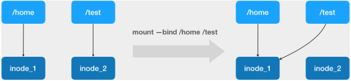
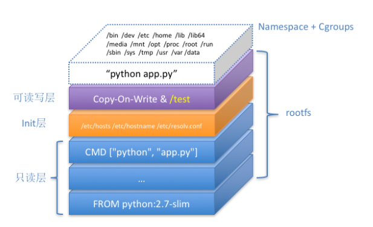

- **一个 Linux 容器的核心实现原理：从 Linux Namespace 的隔离能力、Linux Cgroups 的限制能力，以及基于 rootfs 的文件系统三个角度**。


- Docker发布举例：用 Docker 部署一个用 Python 编写的 Web 应用。
- **Dockerfile 的设计思想，是使用一些标准的原语（即大写高亮的词语），描述所要构建的 Docker 镜像。并且这些原语，都是按顺序处理的**。
- Dockerfile 中的每个原语执行后，都会生成一个对应的镜像层。
- 在使用 Dockerfile 时，可能还会看到一个叫作 ENTRYPOINT 的原语。实际上，它和 CMD 都是 Docker
  容器进程启动所必需的参数，完整执行格式是：“ENTRYPOINT CMD”。统一称 Docker 容器的启动进程为 ENTRYPOINT，而不是 CMD。

```shell
# app.py文件内容
$ cat app.py
from flask import Flask
import socket
import os
 
app = Flask(__name__)
 
@app.route('/')
def hello():
    html = "<h3>Hello {name}!</h3>" \
           "<b>Hostname:</b> {hostname}<br/>"           
    return html.format(name=os.getenv("NAME", "world"), hostname=socket.gethostname())
    
if __name__ == "__main__":
    app.run(host='0.0.0.0', port=80)

# requirements.txt文件内容
$ cat requirements.txt
Flask

# Dockerfile文件内容
$ cat Dockerfile
# 使用官方提供的 Python 开发镜像作为基础镜像
FROM python:2.7-slim
# 将工作目录切换为 /app
WORKDIR /app
# 将当前目录下的所有内容复制到 /app 下
ADD . /app
# 使用 pip 命令安装这个应用所需要的依赖
RUN pip install --trusted-host pypi.python.org -r requirements.txt
# 允许外界访问容器的 80 端口
EXPOSE 80
# 设置环境变量
ENV NAME World
# 设置容器进程为：python app.py，即：这个 Python 应用的启动命令
CMD ["python", "app.py"]


# step1、创建打镜像需要的文件
$ ls
Dockerfile  app.py   requirements.txt
# step2、打镜像
$ docker build -t helloworld .
$ docker image ls
REPOSITORY            TAG                 IMAGE ID
helloworld         latest              653287cdf998
# step3、使用镜像启动一个容器
$ docker run -p 4000:80 helloworld
# step4、查看启动后的容器
$ docker ps
CONTAINER ID        IMAGE               COMMAND             CREATED
4ddf4638572d        helloworld       "python app.py"     10 seconds ago
# step5、验证
$ curl http://localhost:4000
<h3>Hello World!</h3><b>Hostname:</b> 4ddf4638572d<br/>
```

- 这个容器运行起来后，又在里面做了一些操作，并且要把操作结果保存到镜像里，比如：

```shell
$ docker exec -it 4ddf4638572d /bin/sh
# 在容器内部新建了一个文件
root@4ddf4638572d:/app# touch test.txt
root@4ddf4638572d:/app# exit
 
# 将这个新建的文件提交到镜像中保存
$ docker commit 4ddf4638572d geektime/helloworld:v2
```


- docker exec 是怎么做到进入容器里的呢？
- 如下：一个进程的每种 Linux Namespace，都在它对应的 /proc/[进程号]/ns 下有一个对应的虚拟文件，并且链接到一个真实的Namespace 文件上。
- **一个进程，可以选择加入到某个进程已有的 Namespace 当中，从而达到“进入”这个进程所在容器的目的，这正是 docker exec 的实现原理**。
- 这个操作所依赖的，是一个名叫 setns() 的 Linux 系统调用。

```shell
[root@k8s101 ~]# docker run -d -v /test helloworld
f4d12a71164408f384fb4a23bb50db9ba95a98121366612fa956d28523bb59fc
[root@k8s101 ~]# docker ps
CONTAINER ID   IMAGE        COMMAND           CREATED         STATUS         PORTS     NAMES
f4d12a711644   helloworld   "python app.py"   9 seconds ago   Up 8 seconds   80/tcp    magical_herschel
[root@k8s101 ~]#  docker inspect --format '{{ .State.Pid }}' f4d12a711644
3186
[root@k8s101 ~]# ls -l  /proc/3186/ns
total 0
lrwxrwxrwx 1 root root 0 Aug 19 10:37 ipc -> ipc:[4026532473]
lrwxrwxrwx 1 root root 0 Aug 19 10:37 mnt -> mnt:[4026532471]
lrwxrwxrwx 1 root root 0 Aug 19 10:36 net -> net:[4026532476]
lrwxrwxrwx 1 root root 0 Aug 19 10:37 pid -> pid:[4026532474]
lrwxrwxrwx 1 root root 0 Aug 19 10:37 user -> user:[4026531837]
lrwxrwxrwx 1 root root 0 Aug 19 10:37 uts -> uts:[4026532472]
```


- Docker 项目另一个重要的内容：Volume（数据卷）
- Volume 机制，允许你将宿主机上指定的目录或者文件，挂载到容器里面进行读取和修改操作。
- **Docker 要做的是在一个正确的时机，进行一次绑定挂载，Docker 就可以成功地将一个宿主机上的目录或文件，不动声色地挂载到容器中**。
- 正确的时机：需要在 rootfs 准备好之后，在执行 chroot 之前，把 Volume 指定的宿主机目录（比如 /home 目录），挂载到指定的容器目录（比如/test 目录）在宿主机上对应的目录（即 /var/lib/docker/aufs/mnt/[可读写层 ID]/test）上，这个 Volume 的挂载工作就完成了。
  这种挂在机制也能保证容器的隔离性不会被 Volume 打破。由于执行这个挂载操作时，“容器进程”已经创建了，也就意味着此时 Mount Namespace 已经开启了。所以，这个挂载事件只在这个容器里可见。
- 这里提到的 " 容器进程 "，是 Docker 创建的一个容器初始化进程 (dockerinit)，而不是应用进程 (ENTRYPOINT + CMD)。**dockerinit会负责完成根目录的准备、挂载设备和目录、配置 hostname 等一系列需要在容器内进行的初始化操作**。最后，它通过 execv()系统调用，让应用进程取代自己，成为容器里的 PID=1 的进程。
- 这里要使用到的挂载技术，就是 Linux 的绑定挂载（bind mount）机制。它的主要作用就是，允许将一个目录或者文件，而不是整个设备，挂载到一个指定的目录上。并且，这时在该挂载点上进行的任何操作，
  只是发生在被挂载的目录或者文件上，而原挂载点的内容则会被隐藏起来且不受影响。
- **在Linux 内核中，绑定挂载实际上是一个 inode 替换的过程**。在 Linux 操作系统中，inode 可以理解为存放文件内容的“对象”，而dentry，也叫目录项，就是访问这个 inode 所使用的“指针”。
  这样当修改 /test 目录时，实际修改的是 /home 目录的 inode。一旦执行 umount 命令，/test 目录原先的内容就会恢复：因为修改真正发生在的，是/home 目录里。




- Docker 容器全景图：



- 一致性理解：**这个容器进程“python app.py”，运行在由 Linux Namespace 和 Cgroups 构成的隔离环境里；而它运行所需要的各种文件，比如python，app.py，以及整个操作系统文件，则由多个联合挂载在一起的 rootfs 层提供**。
- rootfs 层的最下层，是来自 Docker 镜像的只读层【Dockerfile文件】。
- 在只读层之上，是 Docker 自己添加的 Init 层，用来存放被临时修改过的 /etc/hosts 等文件。
- 在 rootfs 的最上层是一个可读写层，它以 Copy-on-Write 的方式存放任何对只读层的修改，容器声明的 Volume 的挂载点，也出现在这一层。