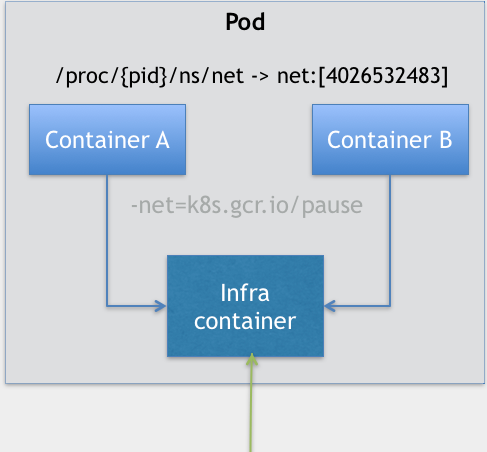

- 思考一个问题：为什么需要Pod？

- Pod，是 Kubernetes 项目中最小的 API 对象。Pod，是 Kubernetes 项目的原子调度单位。
- “三句箴言”：Namespace 做隔离，Cgroups 做限制，rootfs 做文件系统。
- 容器，就是未来云计算系统中的进程。容器镜像就是这个系统里的“.exe”安装包。Pod，实际上是在扮演传统基础设施里“虚拟机”的角色，Kubernetes
  扮演的是操作系统。
- 容器的本质是进程。

- 为什么需要Pod？原因1：Pod 和 容器 类似 进程组和进程 之间的关系。
- 对于容器来说，一个容器永远只能管理一个进程。更确切地说，一个容器，就是一个进程。这是容器技术的“天性”，不可能被修改。
- 我们部署的应用，往往都存在着类似于“进程和进程组”的关系。更具体地说，就是这些应用之间有着密切的协作关系，使得它们必须部署在同一台机器上。
- 像这样容器间的紧密协作，我们可以称为“超亲密关系”。这些具有“超亲密关系”容器的典型特征包括但不限于：互相之间会发生直接的文件交换、使用
  localhost 或者 Socket 文件进行本地通信、会发生非常频繁的远程调用、需要共享某些 Linux Namespace（比如，一个容器要加入另一个容器的
  Network Namespace）等等。
- 如何将这些具有亲密关系的容器统一调度？
- Pod 是 Kubernetes 里的原子调度单位。这就意味着，Kubernetes 项目的调度器，是统一按照 Pod 而非容器的资源需求进行计算的。

- 为什么需要Pod？原因2：容器设计模式。
- Pod只是一个逻辑概念。Kubernetes 真正处理的，还是宿主机操作系统上 Linux 容器的 Namespace 和
  Cgroups，而并不存在一个所谓的 Pod 的边界或者隔离环境。
- Pod 的实现原理：Pod 里的所有容器，共享的是同一个 Network Namespace，并且可以声明共享同一个 Volume。
- 在 Kubernetes 项目里，Pod 的实现需要使用一个中间容器，这个容器叫作 Infra 容器。在这个 Pod 中，Infra
  容器永远都是第一个被创建的容器，而其他用户定义的容器，则通过 Join Network Namespace 的方式，与 Infra 容器关联在一起。
- 在 Infra 容器“Hold 住”Network Namespace 后，用户容器就可以加入到 Infra 容器的 Network Namespace 当中。

- 如上图所示，这个 Pod 里有两个用户容器 A 和 B，还有一个 Infra 容器。很容易理解，在 Kubernetes 项目里，Infra
  容器一定要占用极少的资源，所以它使用的是一个非常特殊的镜像，叫作：k8s.gcr.io/pause。这个镜像是一个用汇编语言编写的、永远处于“暂停”状态的容器，
  解压后的大小也只有 100~200 KB 左右。
- 这也就意味着，对于 Pod 里的容器 A 和容器 B 来说：
- 它们可以直接使用 localhost 进行通信；
- 它们看到的网络设备跟 Infra 容器看到的完全一样；
- 一个 Pod 只有一个 IP 地址，也就是这个 Pod 的 Network Namespace 对应的 IP 地址；
- 当然，其他的所有网络资源，都是一个 Pod 一份，并且被该 Pod 中的所有容器共享；
- Pod 的生命周期只跟 Infra 容器一致，而与容器 A 和 B 无关。
- 对于同一个 Pod 里面的所有用户容器来说，它们的进出流量，也可以认为都是通过 Infra 容器完成的。这一点很重要，因为将来如果要为
  Kubernetes 开发一个网络插件时，应该重点考虑的是如何配置这个 Pod 的 Network Namespace，而不是每一个用户容器如何使用网络配置，
  这是没有意义的。

- 有了这个设计之后，共享 Volume 就简单多了：Kubernetes 项目只要把所有 Volume 的定义都设计在 Pod 层级即可。 eg:
  example-volume.yaml

- Pod 这种“超亲密关系”容器的设计思想，实际上就是希望，当用户想在一个容器里跑多个功能并不相关的应用时，应该优先考虑它们是不是更应该被描述成一个
  Pod 里的多个容器。
- 第一个最典型的例子是：WAR 包与 Web 服务器。eg：example-war-web.yaml 。WAR 包容器的类型是一个 Init Container。在 Pod 中，所有
  Init Container 定义的容器，都会比 spec.containers 定义的用户容器先启动。并且，Init Container
  容器会按顺序逐一启动，而直到它们都启动并且退出了，用户容器才会启动。所以，等 Tomcat 容器启动时，它的 webapps 目录下就一定会存在
  sample.war 文件：这个文件正是 WAR 包容器启动时拷贝到这个 Volume 里面的，而这个 Volume 是被这两个容器共享的。
- 这种解决了 WAR 包与 Tomcat 容器之间耦合关系问题的“组合”方式正是容器设计模式里最常用的一种模式，它的名字叫：sidecar。
- sidecar 指的就是我们可以在一个 Pod 中，启动一个辅助容器，来完成一些独立于主进程（主容器）之外的工作。
- 第二个典型例子，是容器的日志收集。比如，现在有一个应用，需要不断地把日志文件输出到容器的 /var/log 目录中。就可以把一个 Pod
  里的 Volume 挂载到应用容器的 /var/log 目录上，在这个 Pod 里同时运行一个 sidecar 容器，它也声明挂载同一个 Volume 到自己的
  /var/log 目录上。sidecar 容器就只需要做一件事儿，那就是不断地从自己的 /var/log 目录里读取日志文件，转发到 MongoDB 或者
  Elasticsearch 中存储起来。最基本的日志收集工作就完成了。

- 除了共享 Volume，Pod 的另一个重要特性是，它的所有容器都共享同一个 Network Namespace。这就使得很多与 Pod 网络相关的配置和管理，也都可以交给sidecar 完成，而完全无须干涉用户容器。这里最典型的例子莫过于 Istio 这个微服务治理项目【Istio 项目使用 sidecar容器完成微服务治理的原理】。
