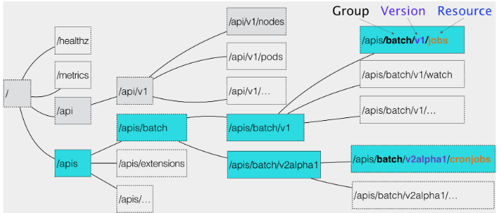

- 如何使用控制器模式，同 Kubernetes 里 API 对象的“增、删、改、查”进行协作，进而完成用户业务逻辑的编写过程。从“使用 Kubernetes
  部署代码”，到“使用 Kubernetes 编写代码”的蜕变过程，正是从一个 Kubernetes 用户，到 Kubernetes 玩家的晋级之路。如何理解“Kubernetes
  编程范式”，如何为 Kubernetes 添加自定义 API 对象，编写自定义控制器，正是这个晋级过程中的关键点。
- 当把一个 YAML 文件提交给 Kubernetes 之后，它究竟是如何创建出一个 API 对象的呢？

- 在 Kubernetes 项目中，一个 API 对象在 Etcd 里的完整资源路径，是由：Group（API 组）、Version（API 版本）和 Resource（API
  资源类型）三个部分组成的。
  

- k8s拿到一个yaml文件，是如何对 Resource、Group 和 Version 进行解析，从而在 Kubernetes 项目里找到 对应
  对象[eg:pod、deploy、cronjob等]的定义呢？以“apiVersion: batch/v2alpha1 kind: CronJob”为例
  首先，Kubernetes 会匹配 API 对象的组。—— batch
  然后，Kubernetes 会进一步匹配到 API 对象的版本号。—— v2alpha1
  最后，Kubernetes 会匹配 API 对象的资源类型。—— CronJob

- 举例：APIServer 创建一个 CronJob 对象的流程：

首先，当我们发起了创建 CronJob 的 POST 请求之后，我们编写的 YAML 的信息就被提交给了 APIServer。 而 APIServer
的第一个功能，就是过滤这个请求，并完成一些前置性的工作，比如授权、超时处理、审计等。

然后，请求会进入 MUX 和 Routes 流程。如果你编写过 Web Server 的话就会知道，MUX 和 Routes 是 APIServer 完成 URL 和 Handler
绑定的场所。而 APIServer 的 Handler 要做的事情，就是按照我刚刚介绍的匹配过程，找到对应的 CronJob 类型定义。

接着，APIServer 最重要的职责就来了：根据这个 CronJob 类型定义，使用用户提交的 YAML 文件里的字段，创建一个 CronJob
对象。而在这个过程中，APIServer 会进行一个 Convert 工作，即：把用户提交的 YAML 文件，转换成一个叫作 Super Version 的对象，它正是该
API 资源类型所有版本的字段全集。这样用户提交的不同版本的 YAML 文件，就都可以用这个 Super Version 对象来进行处理了。

接下来，APIServer 会先后进行 Admission() 和 Validation() 操作。比如Admission Controller 和 Initializer，就都属于 Admission
的内容。 而 Validation，则负责验证这个对象里的各个字段是否合法。这个被验证过的 API 对象，都保存在了 APIServer 里一个叫作
Registry 的数据结构中。也就是说，只要一个 API 对象的定义能在 Registry 里查到，它就是一个有效的 Kubernetes API 对象。

最后，APIServer 会把验证过的 API 对象转换成用户最初提交的版本，进行序列化操作，并调用 Etcd 的 API 把它保存起来。

- 由于同时要兼顾性能、API 完备性、版本化、向后兼容等很多工程化指标，所以 Kubernetes 团队在 APIServer 项目里大量使用了 Go
  语言的代码生成功能，来自动化诸如 Convert、DeepCopy 等与 API 资源相关的操作。这部分自动生成的代码，曾一度占到 Kubernetes
  项目总代码的 20%~30%。这导致在APIServer 中添加一个 Kubernetes 风格的 API 资源类型，是一个非常困难的工作——CRD（Custom
  Resource Definition）：自定义 API 资源。

- 举例：为 Kubernetes 添加一个名叫 Network 的 API 资源类型。
  如example-network.yaml
  1、第一步，声明一个CRD，让k8s就能够认识和处理所有声明了 API 类型是“samplecrd.k8s.io/v1/network”的 YAML文件。
  如network-crd.yaml
  2、第二步，进行代码编辑，让k8s能够认识yaml文件中spec模板下的字段含义。
  如代码 https://github.com/resouer/k8s-controller-custom-resource
  这些代码有一套生成规则：https://cloud.redhat.com/blog/kubernetes-deep-dive-code-generation-customresources
  “pkg/apis/samplecrd/v1/register.go”的作用就是注册一个类型（Type）给 APIServer。
  register.go 文件里的内容其实是非常固定的，你以后可以直接使用我提供的这部分代码做模板，然后把其中的资源类型、GroupName 和
  Version 替换成你自己的定义即可。
  3、第三步，使用 Kubernetes 提供的代码生成工具，为上面定义的 Network 资源类型自动生成 clientset、informer 和 lister。

- 代码生成工具名叫k8s.io/code-generator，使用方法如下所示：

```shell
# 代码生成的工作目录，也就是我们的项目路径
$ ROOT_PACKAGE="github.com/resouer/k8s-controller-custom-resource"
# API Group
$ CUSTOM_RESOURCE_NAME="samplecrd"
# API Version
$ CUSTOM_RESOURCE_VERSION="v1"
 
# 安装 k8s.io/code-generator
$ go get -u k8s.io/code-generator/...
$ cd $GOPATH/src/k8s.io/code-generator
 
# 执行代码自动生成，其中 pkg/client 是生成目标目录，pkg/apis 是类型定义目录
$ ./generate-groups.sh all "$ROOT_PACKAGE/pkg/client" "$ROOT_PACKAGE/pkg/apis" "$CUSTOM_RESOURCE_NAME:$CUSTOM_RESOURCE_VERSION"
```

- 代码写完，如果应用？→ 请看下一篇：为 Network 这个自定义 API 对象编写一个自定义控制器（Custom Controller）。
