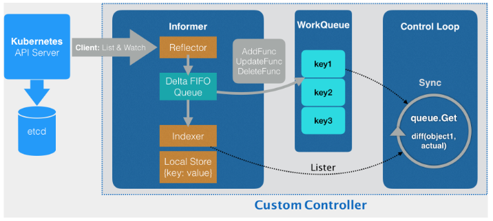

- 为 上篇提到的 Network 这个自定义 API 对象编写一个自定义控制器（Custom Controller）。
- “声明式 API”并不像“命令式 API”那样有着明显的执行逻辑。这就使得基于声明式 API 的业务功能实现，往往需要通过控制器模式来“监视”API
  对象的变化（比如，创建或者删除 Network），然后以此来决定实际要执行的具体工作。

- 总得来说，编写自定义控制器代码的过程包括：编写 main 函数、编写自定义控制器的定义，以及编写控制器里的业务逻辑三个部分。
- 一、编写 main 函数
- 1、第一步：main 函数根据我提供的 Master 配置（APIServer 的地址端口和 kubeconfig 的路径），创建一个 Kubernetes 的
  client（kubeClient）和 Network 对象的 client（networkClient）。
  Kubernetes 里所有的 Pod 都会以 Volume 的方式自动挂载 Kubernetes 的默认 ServiceAccount。所以，这个控制器就会直接使用默认
  ServiceAccount 数据卷里的授权信息，来访问 APIServer。
- 2、第二步：main 函数为 Network 对象创建一个叫作 InformerFactory（即：networkInformerFactory）的工厂，并使用它生成一个
  Network 对象的 Informer，传递给控制器。
- 3、第三步：main 函数启动上述的 Informer，然后执行 controller.Run，启动自定义控制器。



- 自定义控制器【举例：Network】的工作原理【如上图】：
- 这个控制器要做的第一件事，是从 Kubernetes 的 APIServer 里获取它所关心的对象【这里也就是定义的 Network 对象】，通过Informer通知器。
- Informer 与 API 对象是一一对应的，所以这里传递给自定义控制器的，正是一个 Network 对象的 Informer（Network Informer）
- Reflector：Network Informer 正是使用 networkClient，跟 APIServer 建立了连接。不过，真正负责维护这个连接的，则是
  Informer 所使用的 Reflector 包。
- ListAndWatch：Reflector 使用的是一种叫作ListAndWatch的方法，来“获取”并“监听”这些 Network 对象实例的变化。ListAndWatch
  方法的含义是：首先，通过 APIServer 的 LIST API“获取”所有最新版本的 API 对象；然后，再通过 WATCH API 来“监听”所有这些 API
  对象的变化。
- Delta：Reflector 收到“事件通知”。该事件及它对应的 API 对象这个组合，就被称为增量（Delta）。
- Delta FIFO Queue：增量Delta会被放进一个 Delta FIFO Queue（即：增量先进先出队列）中。
- Store：Informe 会不断地从 Delta FIFO Queue 里读取（Pop）增量。每拿到一个增量，Informer
  就会判断这个增量里的事件类型，然后创建或者更新本地对象的缓存。这个缓存，在 Kubernetes 里一般被叫作 Store。
- Indexer：如果事件类型是 Added（添加对象），那么 Informer 就会通过一个叫作 Indexer 的库把这个增量里的 API
  对象保存在本地缓存中，并为它创建索引。相反地，如果增量的事件类型是 Deleted（删除对象），那么 Informer 就会从本地缓存中删除这个对象。
- Informer 的第一个职责：同步本地缓存的工作，也是它最重要的职责。
- Informer 的第二个职责，则是根据这些事件的类型，触发事先注册好的 ResourceEventHandler。这些 Handler，需要在
  创建控制器的时候注册给它对应的Informer。

- 二、编写自定义控制器
- 1、在 main 函数里创建了两个 client（kubeclientset 和 networkclientset），然后在NewController这段代码里，使用这两个 client
  和前面创建的 Informer，初始化自定义控制器。
- WorkQueue：这个工作队列的作用是，负责同步 Informer 和控制循环之间的数据。
- 为 networkInformer 注册了三个 Handler（AddFunc、UpdateFunc 和 DeleteFunc），分别对应 API
  对象的“添加”“更新”和“删除”事件。而具体的处理操作，都是将该事件对应的 API 对象加入到工作队列中。实际入队的并不是 API
  对象本身，而是它们的 Key。即：该 API 对象的<namespace>/<name>。
- 后面即编写的控制循环，则会不断地从这个工作队列里拿到这些 Key，然后开始执行真正的控制逻辑。
- 控制循环即 main 函数最后调用 controller.Run() 启动的“控制循环”。

- 三、编写控制器里的业务逻辑
- 在一个执行周期里processNextWorkItem，首先从工作队列里出队（workqueue.Get）了一个成员key，根据key尝试从 Informer
  维护的缓存中【networksLister】拿到了它所对应的 Network 对象。
- 期望状态：来自yaml文件，它已经被 Informer 缓存在了本地。
- 实际状态：通过 API 来查询实际的状态。
- 通过对比“期望状态”和“实际状态”的差异，完成了一次调协（Reconcile）的过程。


- 综上所述，所谓 Informer，其实就是一个带有本地缓存和索引机制的、可以注册 EventHandler 的 client。它是自定义控制器跟
  APIServer进行数据同步的重要组件。
- Informer 通过一种叫作 ListAndWatch 的方法，把 APIServer 中的 API 对象缓存在了本地，并负责更新和维护这个缓存。

- resync：缓存有效性的保证——每经过 resyncPeriod 指定的时间，Informer 维护的本地缓存，都会使用最近一次 LIST
  返回的结果强制更新一次，从而保证缓存的有效性。


- 编辑完以上所有代码后，使用代码：

```shell
# Clone repo
$ git clone https://github.com/resouer/k8s-controller-custom-resource$ cd k8s-controller-custom-resource
 
### Skip this part if you don't want to build
# Install dependency
$ go get github.com/tools/godep
$ godep restore
# Build
$ go build -o samplecrd-controller .
 
$ ./samplecrd-controller -kubeconfig=$HOME/.kube/config -alsologtostderr=true
I0915 12:50:29.051349   27159 controller.go:84] Setting up event handlers
I0915 12:50:29.051615   27159 controller.go:113] Starting Network control loop
I0915 12:50:29.051630   27159 controller.go:116] Waiting for informer caches to sync
E0915 12:50:29.066745   27159 reflector.go:134] github.com/resouer/k8s-controller-custom-resource/pkg/client/informers/externalversions/factory.go:117: Failed to list *v1.Network: the server could not find the requested resource (get networks.samplecrd.k8s.io)
```

- 边执行下面操作，边查看日志，理解k8s自定义控制器的流程原理。

- 首先需要创建对应的CRD[如果未创建CRD]

```shell
$ cat crd/network.yaml
apiVersion: apiextensions.k8s.io/v1beta1
kind: CustomResourceDefinition
metadata:
  name: networks.samplecrd.k8s.io
spec:
  group: samplecrd.k8s.io
  version: v1
  names:
    kind: Network
    plural: networks
  scope: Namespaced
$ kubectl apply -f crd/network.yaml
```

- 创建 Network 对象

```shell
$ cat example/example-network.yaml 
apiVersion: samplecrd.k8s.io/v1
kind: Network
metadata:
  name: example-network
spec:
  cidr: "192.168.0.0/16"
  gateway: "192.168.0.1"
$ kubectl apply -f example/example-network.yaml 
network.samplecrd.k8s.io/example-network created
```

- 修改一下这个 YAML 文件的内容

```shell
$ cat example/example-network.yaml 
apiVersion: samplecrd.k8s.io/v1
kind: Network
metadata:
  name: example-network
spec:
  cidr: "192.168.1.0/16"
  gateway: "192.168.1.1"
# 通过kubectl apply 命令来提交这次更新
$ kubectl apply -f example/example-network.yaml 
network.samplecrd.k8s.io/example-network created
```

- 最后，我再把这个对象删除掉：

```shell
$ kubectl delete -f example/example-network.yaml
```

- 实际上，这套流程不仅可以用在自定义 API 资源上，也完全可以用在 Kubernetes 原生的默认 API 对象上。
- 在这个自定义控制器里面，我可以通过对自定义 API 对象和默认 API 对象进行协同，从而实现更加复杂的编排功能。比如：用户每创建一个新的
  Deployment，这个自定义控制器，就可以为它创建一个对应的 Network 供它使用。


- Kubernetes API 编程范式的核心思想：
- 所谓的 Informer，就是一个自带缓存和索引机制，可以触发 Handler 的客户端库。这个本地缓存在 Kubernetes 中一般被称为
  Store，索引一般被称为 Index。
- Informer 使用了 Reflector 包，它是一个可以通过 ListAndWatch 机制获取并监视 API 对象变化的客户端封装。
- Reflector 和 Informer 之间，用到了一个“增量先进先出队列”进行协同。而 Informer 与要编写的控制循环之间，则使用了一个工作队列来进行协同。

- 在实际应用中，除了控制循环之外的所有代码，实际上都是 Kubernetes 自动生成的，即：pkg/client/{informers, listers,
  clientset}里的内容。
- 而这些自动生成的代码，就为我们提供了一个可靠而高效地获取 API 对象“期望状态”的编程库。
- 所以，接下来，作为开发者，只需要关注如何拿到“实际状态”，然后如何拿它去跟“期望状态”做对比，从而决定接下来要做的业务逻辑即可。

