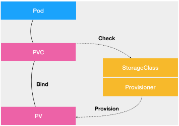

- PV 描述的，是持久化存储数据卷。
- PVC 描述的，则是 Pod 所希望使用的持久化存储的属性。
- PVC 和 PV 的设计，其实跟“面向对象”的思想完全一致。PVC 可以理解为持久化存储的“接口”，它提供了对某种持久化存储的描述，但不提供具体的实现；
  而这个持久化存储的实现部分则由 PV 负责完成。
- PersistentVolumeController——在 Kubernetes 中，实际上存在着一个专门处理持久化存储的控制器，叫作 Volume Controller。这个
  Volume Controller维护着多个控制循环，其中有一个循环，扮演的就是撮合 PV 和 PVC 的“红娘”的角色。它的名字叫作
  PersistentVolumeController。
- PersistentVolumeController 会不断地查看当前每一个 PVC，是不是已经处于 Bound（已绑定）状态。如果不是，那它就会遍历所有的、可用的
  PV，并尝试将其与这个“单身”的 PVC 进行绑定。这样，Kubernetes 就可以保证用户提交的每一个 PVC，只要有合适的 PV
  出现，它就能够很快进入绑定状态，从而结束“单身”之旅。

- 用户创建的 PVC 要真正被容器使用起来，就必须先和某个符合条件的 PV 进行绑定。这里要检查的条件，包括两部分：
- 第一个条件，当然是 PV 和 PVC 的 spec 字段。比如，PV 的存储（storage）大小，就必须满足 PVC 的要求。
- 第二个条件，则是 PV 和 PVC 的 storageClassName 字段必须一样。


- 这个 PV 对象，又是如何变成容器里的一个持久化存储的呢？
- 所谓容器的 Volume，其实就是将一个宿主机上的目录，跟一个容器里的目录绑定挂载在了一起。而所谓的“持久化
  Volume”，指的就是这个宿主机上的目录，具备“持久性”。大多数情况下，持久化 Volume
  的实现，往往依赖于一个远程存储服务，比如：远程文件存储（比如，NFS、GlusterFS）、远程块存储（比如，公有云提供的远程磁盘）等等。


- 两阶段处理：Kubernetes 需要做的工作，就是使用这些存储服务，来为容器准备一个持久化的宿主机目录，以供将来进行绑定挂载时使用。
  而所谓“持久化”，指的是容器在这个目录里写入的文件，都会保存在远程存储中，从而使得这个目录具备了“持久性”。这个准备“持久化”宿主机目录的过程，
  我们可以形象地称为“两阶段处理”。
- 第一阶段：Attach。为虚拟机挂载远程磁盘的操作。
- 对于“第一阶段”（Attach），Kubernetes 提供的可用参数是 nodeName，即宿主机的名字。

```shell
# Attach阶段：比如Google Cloud 的 Persistent Disk远程块存储服务，kubelet 就需要先调用 Goolge Cloud 的 API，将它所提供的 Persistent Disk 挂载到 Pod 所在的宿主机上。
$ gcloud compute instances attach-disk < 虚拟机名字 > --disk < 远程磁盘名字 >
```

- 第二阶段：Mount。将磁盘设备格式化并挂载到 Volume 宿主机目录的操作。
- 而对于“第二阶段”（Mount），Kubernetes 提供的可用参数是 dir，即 Volume 的宿主机目录。

```shell
# Mount阶段：
# 通过 lsblk 命令获取磁盘设备 ID
$ sudo lsblk
# 格式化成 ext4 格式
$ sudo mkfs.ext4 -m 0 -F -E lazy_itable_init=0,lazy_journal_init=0,discard /dev/< 磁盘设备 ID>
# 挂载到挂载点
$ sudo mkdir -p /var/lib/kubelet/pods/<Pod 的 ID>/volumes/kubernetes.io~<Volume 类型 >/<Volume 名字 >
```

- 对应地，在删除一个 PV 的时候，Kubernetes 也需要 Unmount 和 Detach 两个阶段来处理。


- 在 Kubernetes 中，上述关于 PV 的“两阶段处理”流程，是靠独立于 kubelet 主控制循环（Kubelet Sync Loop）之外的两个控制循环来实现的。
- AttachDetachController：控制“第一阶段”的 Attach（以及 Detach）操作。它的作用，就是不断地检查每一个 Pod 对应的 PV，和这个 Pod
  所在宿主机之间挂载情况。从而决定，是否需要对这个 PV 进行 Attach（或者 Detach）操作。这发生在 Master 节点上。
- VolumeManagerReconciler：控制“第二阶段”的 Mount（以及 Unmount）操作。是一个独立于 kubelet 主循环的 Goroutine。这发生在 Pod
  对应的宿主机上。
- kubelet 的一个主要设计原则，就是它的主控制循环绝对不可以被 block。所有通过这样将 Volume 的处理同 kubelet
  的主循环解耦，Kubernetes 就避免了这些耗时的远程挂载操作拖慢 kubelet 的主控制循环，进而导致 Pod 的创建效率大幅下降的问题。


- Kubernetes 为我们提供了一套可以自动创建 PV 的机制，即：Dynamic Provisioning。【人工管理 PV 的方式就叫作 Static
  Provisioning】
- Dynamic Provisioning 机制工作的核心：StorageClass，StorageClass API对象的作用，其实就是创建 PV 的模板。它定义了如下两部分的内容：
- 第一，PV 的属性。比如，存储类型、Volume 的大小等等。
- 第二，创建这种 PV 需要用到的存储插件。比如，Ceph 等等。
- 有了这样两个信息之后，Kubernetes 就能够根据用户提交的 PVC，找到一个对应的 StorageClass。然后，Kubernetes 就会调用该
  StorageClass 声明的存储插件，创建出需要的 PV。
- Kubernetes 只会将 StorageClass 相同的 PVC 和 PV 绑定起来。

- 如果集群已经开启了名叫 DefaultStorageClass 的 Admission Plugin，它就会为 PVC 和 PV 自动添加一个默认的
  StorageClass；否则，PVC 的 storageClassName 的值就是“”，这也意味着它只能够跟 storageClassName 也是“”的 PV 进行绑定。


- 这些概念之间的关系，可以用如下所示的一幅示意图描述：



- PVC 描述的，是 Pod 想要使用的持久化存储的属性，比如存储的大小、读写权限等。
- PV 描述的，则是一个具体的 Volume 的属性，比如 Volume 的类型、挂载目录、远程存储服务器地址等。
- StorageClass 的作用，则是充当 PV 的模板。并且，只有同属于一个 StorageClass 的 PV 和 PVC，才可以绑定在一起。它的
  的另一个重要作用，是指定 PV 的 Provisioner（存储插件）。
