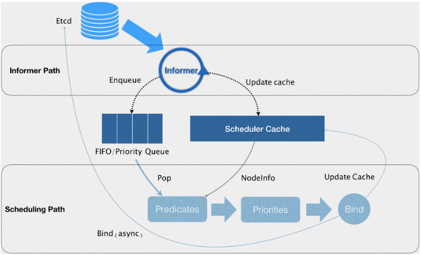

- 在 Kubernetes 项目中，默认调度器的主要职责，就是为一个新创建出来的 Pod，寻找一个最合适的节点（Node）。
- 这里“最合适”的含义，包括两层：
  从集群所有的节点中，根据调度算法挑选出所有可以运行该 Pod 的节点。
  从第一步的结果中，再根据调度算法挑选一个最符合条件的节点作为最终结果。
- 默认调度机制：所以在具体的调度流程中，默认调度器会首先调用一组叫作 [Predicate] 的调度算法，来检查每个 Node。然后，再调用一组叫作
  [Priority] 的调度算法，来给上一步得到的结果里的每个 Node 打分。最终的调度结果，就是得分最高的那个 Node。
- 调度机制的工作原理，可以用如下所示的一幅示意图来表示：【Kubernetes 的调度器的核心，实际上就是两个相互独立的控制循环】
  

- Kubernetes 的调度器的核心，实际上就是两个相互独立的控制循环：
- 第一个控制循环，可以称之为 Informer Path。它的主要目的，是启动一系列 Informer，用来监听（Watch）Etcd 中 Pod、Node、Service
  等与调度相关的 API 对象的变化。
- PriorityQueue：Kubernetes 的调度队列是一个PriorityQueue（优先级队列：主要是出于调度优先级和抢占的考虑），
  并且当某些集群信息发生变化的时候，调度器还会对调度队列里的内容进行一些特殊操作。
- scheduler cache：Kubernetes 的默认调度器还要负责对调度器缓存（即：scheduler cache）进行更新。事实上，Kubernetes
  调度部分进行性能优化的一个最根本原则，就是尽最大可能将集群信息 Cache 化，以便从根本上提高 Predicate 和 Priority
  调度算法的执行效率。
- 第二个控制循环，是调度器负责 Pod 调度的主循环，我们可以称之为 Scheduling Path。
- Scheduling Path 的主要逻辑，就是不断地从调度队列里出队一个 Pod。然后，调用 Predicates 算法进行“过滤”。这一步“过滤”得到的一组
  Node，就是所有可以运行这个 Pod 的宿主机列表。当然，Predicates 算法需要的 Node 信息，都是从 Scheduler Cache
  里直接拿到的，这是调度器保证算法执行效率的主要手段之一。
- 调度器就会再调用 Priorities 算法为上述列表里的 Node 打分，分数从 0 到 10。得分最高的 Node，就会作为这次调度的结果。
- 调度算法执行完成后，调度器就需要将 Pod 对象的 nodeName 字段的值，修改为上述 Node 的名字。这个步骤在 Kubernetes 里面被称作
  Bind。
- Kubernetes 的默认调度器在 Bind 阶段，只会更新 Scheduler Cache 里的 Pod 和 Node 的信息。这种基于“乐观”假设的 API 对象更新方式，在
  Kubernetes 里被称作 Assume。
- Assume 之后，调度器才会创建一个 Goroutine 来异步地向 APIServer 发起更新 Pod 的请求，来真正完成 Bind 操作。
- Admit操作：正是由于上述 Kubernetes 调度器的“乐观”绑定的设计，当一个新的 Pod 完成调度需要在某个节点上运行起来之前，该节点上的
  kubelet 还会通过一个叫作 Admit 的操作来再次验证该 Pod 是否确实能够运行在该节点上。这一步 Admit 操作，实际上就是把一组叫作
  GeneralPredicates 的、最基本的调度算法，比如：“资源是否可用”“端口是否冲突”等再执行一遍，作为 kubelet 端的二次确认。

- Kubernetes 默认调度器重要的设计，除了上述的“Cache 化”和“乐观绑定”，还有就是“无锁化”。
- 在 Scheduling Path 上，调度器会启动多个 Goroutine 以节点为粒度并发执行 Predicates 算法，从而提高这一阶段的执行效率。而与之类似的，Priorities
  算法也会以 MapReduce 的方式并行计算然后再进行汇总。而在这些所有需要并发的路径上，调度器会避免设置任何全局的竞争资源，从而免去了使用锁进行同步带来的巨大的性能损耗。

- Kubernetes 下一步发展的方向，是组件的轻量化、接口化和插件化。所以，我们才有了 CRI、CNI、CSI、CRD、Aggregated
  APIServer、Initializer、Device Plugin 等各个层级的可扩展能力。默认调度器，却成了 Kubernetes 项目里最后一个没有对外暴露出良好定义过的、
  可扩展接口的组件。
- Kubernetes 默认调度器的可扩展性设计，可以用如下所示的一幅示意图来描述：
  
- 默认调度器的可扩展机制，在 Kubernetes 里面叫作 Scheduler Framework。【每一个绿色的箭头都是一个可以插入自定义逻辑的接口】
  顾名思义，这个设计的主要目的，就是在调度器生命周期的各个关键点上，为用户暴露出可以进行扩展和实现的接口，从而实现由用户自定义调度器的能力。
