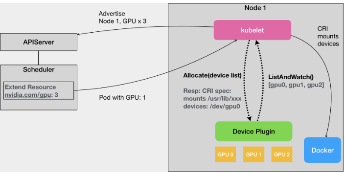

- 2016 年，随着 AlphaGo 的走红和 TensorFlow 项目的异军突起，一场名为 AI 的技术革命迅速从学术界蔓延到了工业界，所谓的 AI
  元年，就此拉开帷幕。因此 Kubernetes 亟待实现的功能，就是对 GPU 等硬件加速设备管理的支持。
- 对GPU 的支持上最基本的诉求其实非常简单：只要在 Pod 的 YAML 里面，声明某容器需要的 GPU 个数，那么 Kubernetes
  创建的容器里就应该出现对应的 GPU 设备【比如 /dev/nvidia0；】，以及它对应的驱动目录【比如 /usr/local/nvidia/*】。
- 在 Kubernetes 的 GPU 支持的实现里，kubelet 实际上就是将上述两部分内容，设置在了创建该容器的 CRI （Container Runtime
  Interface）参数里面。这样，等到该容器启动之后，对应的容器里就会出现 GPU 设备和驱动的路径了。K8s中使用了一种叫作 Extended
  Resource（ER）的特殊字段来负责传递 GPU 的信息。eg：example-gpu.yaml

- 在 Kubernetes 中，对所有硬件加速设备进行管理的功能，都是由一种叫作 Device Plugin 的插件来负责的。这其中，当然也就包括了对该硬件的
  Extended Resource 进行汇报的逻辑。
- Kubernetes 的 Device Plugin 机制示意图：

- Device Plugin 机制原理：首先，对于每一种硬件设备，都需要有它所对应的 Device Plugin 进行管理，这些 Device Plugin，都通过
  gRPC 的方式，同 kubelet 连接起来。
- 这个 Device Plugin 会通过一个叫作 ListAndWatch 的 API，定期向 kubelet 汇报该 Node 上 GPU 的列表。kubelet 本身，会将这个
  GPU 的 ID 列表保存在自己的内存里，并通过 ListAndWatch API 定时更新。
- 当一个 Pod 想要使用一个 GPU 的时候，它只需要在 Pod 的 limits 字段声明nvidia.com/gpu: 1。那么接下来，Kubernetes
  的调度器就会从它的缓存里，寻找 GPU 数量满足条件的 Node，然后将缓存里的 GPU 数量减 1，完成 Pod 与 Node 的绑定。
- 调度成功后的 Pod 信息，自然就会被对应的 kubelet 拿来进行容器操作。此时，kubelet 就会向本机的 Device Plugin 发起一个
  Allocate() 请求。这个请求携带的参数，正是即将分配给该容器的设备 ID 列表。
- 当 Device Plugin 收到 Allocate 请求之后，它就会根据 kubelet 传递过来的设备 ID，从 Device Plugin 里找到这些设备对应
  的设备路径和驱动目录。
- 当被分配 GPU 对应的设备路径和驱动目录信息被返回给 kubelet 之后，kubelet 就完成了为一个容器分配 GPU 的操作。
- kubelet 会把这些信息追加在创建该容器所对应的 CRI 请求当中。这样，当这个 CRI 请求发给 Docker 之后，Docker
  为你创建出来的容器里，就会出现这个 GPU 设备，并把它所需要的驱动目录挂载进去。

- Device Plugin 的设计，它的整套工作机制和流程上，实际上跟学术界和工业界的真实场景还有着不小的差异。
- 目前 Kubernetes 本身的 Device Plugin 的设计，实际上能覆盖的场景是非常单一的，属于“可用”但是“不好用”的状态。并且， Device
  Plugin 的 API 本身的可扩展性也不是很好。
