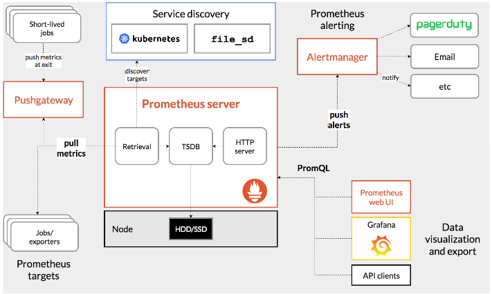
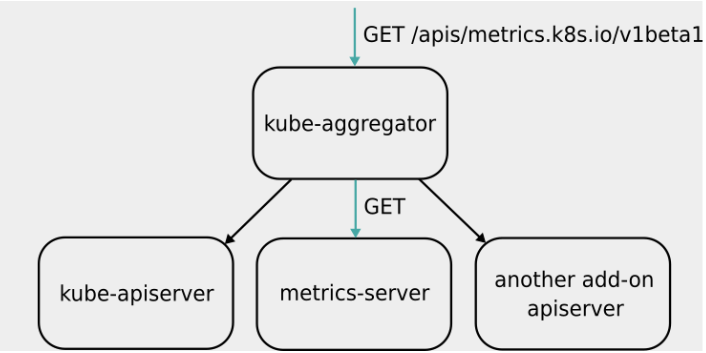

- Prometheus 项目是当年 CNCF 基金会起家时的“第二把交椅”。Prometheus 项目与 Kubernetes 项目一样，也来自于 Google 的 Borg
  体系，它的原型系统，叫作 BorgMon，是一个几乎与 Borg 同时诞生的内部监控系统。而 Prometheus 项目的发起原因也跟 Kubernetes
  很类似，都是希望通过对用户更友好的方式，将 Google 内部系统的设计理念，传递给用户和开发者。
- Prometheus 项目的作用和工作方式官方示意图：



- Prometheus 项目工作的核心，是使用 Pull （抓取）的方式去搜集被监控对象的 Metrics 数据（监控指标数据），然后，再把这些数据保存在一个
  TSDB （时间序列数据库，比如 OpenTSDB、InfluxDB 等）当中，以便后续可以按照时间进行检索。
- 有了这套核心监控机制， Prometheus 剩下的组件就是用来配合这套机制的运行。比如 Pushgateway，可以允许被监控对象以 Push 的方式向
  Prometheus 推送 Metrics 数据。而 Alertmanager，则可以根据 Metrics 信息灵活地设置报警。当然， Prometheus 最受用户欢迎的功能，
  还是通过 Grafana 对外暴露出的、可以灵活配置的监控数据可视化界面。


- 按照 Metrics 数据的来源，来对 Kubernetes 的监控体系做一个汇总：
- 第一种 Metrics，是宿主机的监控数据。这部分数据的提供，需要借助一个由 Prometheus 维护的Node Exporter 工具。
- 第二种 Metrics，是来自于 Kubernetes 的 API Server、kubelet 等组件的 /metrics API。除了常规的
  CPU、内存的信息外，这部分信息还主要包括了各个组件的核心监控指标。
- 第三种 Metrics，是 Kubernetes 相关的监控数据。这部分数据，一般叫作 Kubernetes 核心监控数据（core metrics）。这其中包括了
  Pod、Node、容器【容器相关的 Metrics 主要来自于 kubelet 内置的 cAdvisor 服务】、Service 等主要 Kubernetes 核心概念的
  Metrics。


- Kubernetes 核心监控数据【比如 Pod 和 Node 的资源使用情况】，其实使用的是 Kubernetes 的一个非常重要的扩展能力，叫作 Metrics
  Server【取代 Heapster】。
- 有了 Metrics Server 之后，用户就可以通过标准的 Kubernetes API 来访问到这些监控数据了。比如，下面这个 URL：

```shell
http://127.0.0.1:8001/apis/metrics.k8s.io/v1beta1/namespaces/<namespace-name>/pods/<pod-name>
```

- Metrics Server 并不是 kube-apiserver 的一部分，而是通过 Aggregator 这种插件机制，在独立部署的情况下同 kube-apiserver
  一起统一对外服务的。
- Aggregator APIServer 的工作原理：
  kube-aggregator 其实就是一个根据 URL 选择具体的 API 后端的代理服务器。通过这种方式，就可以很方便地扩展 Kubernetes 的
  API。



- 当 Kubernetes 的 API Server 开启了 Aggregator 模式之后，再访问 apis/metrics.k8s.io/v1beta1 的时候，实际上访问到的是一个叫作
  kube-aggregator 的代理。


- 在具体的监控指标规划上，建议遵循业界通用的 USE 原则和 RED 原则。
- 其中，USE 原则指的是，按照如下三个维度来规划资源监控指标： 【USE 原则主要关注的是“资源”】
- 利用率（Utilization），资源被有效利用起来提供服务的平均时间占比；
- 饱和度（Saturation），资源拥挤的程度，比如工作队列的长度；
- 错误率（Errors），错误的数量。
- 而 RED 原则指的是，按照如下三个维度来规划服务监控指标： 【 RED 原则主要关注的是“服务”】
- 每秒请求数量（Rate）；
- 每秒错误数量（Errors）；
- 服务响应时间（Duration）。
