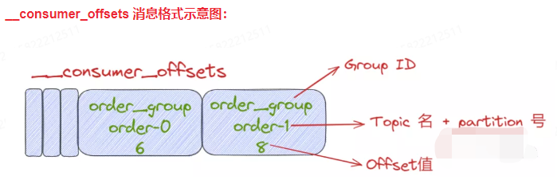

## _consumer_offsets

- Kafka的旧版本重度依赖Zookeeper来实现各种各样的协调管理，包括offset位移的保存。鉴于zk不适合高频写更新，在新版Kafka【0.8版本之后】中，重新设计了大名鼎鼎的consumer_offsets。

- _consumer_offsets：用来再Kafka集群内部保存Kafka Consumer提交的位移信息。它是Kafka自动创建的，类似于普通的Topic。它的消息格式也是Kafka自定义的，人为无法修改。

- consumer_offsets消息结构：它是一个Key-Value键值对。其中 key:<Group ID,Topic,Partition Id>, Value:< Offset >

- _consumer_offsets的创建：

- 如何指定Kafka Offset位移值，重新消费数据？

